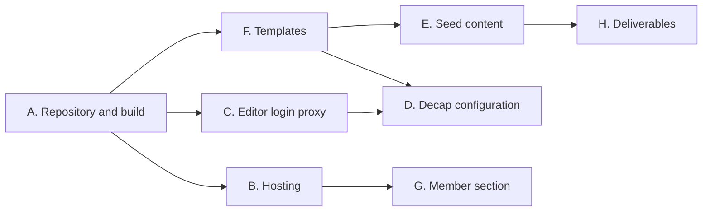

# Roadmap

Implementation roadmap for the git-based prodeko.org described in
[the design document](superpowers/specs/2026-09-18-prodeko-git-cms-design.md).

The target is a working site, not a finished one. Done means an editor signs in
with a Prodeko account, changes a page, and the change appears on a real
address, with real migrated content and a member-only page that cannot be
reached without a login.

## Where the code lives

Three places:

- A new repository, prodeko-org, holding the website. Inside it, `site/` is the
  Hugo site and the Decap configuration, `proxy/` is the editor login service,
  and `tools/migrate/` is the one-off converter from the old database.
- infra-prodeko, for anything that provisions or configures a machine: the
  Caddy configuration, the storage container, DNS, and the proxy container's
  deployment.
- Keycloak at id.prodeko.org, configured by hand through the admin console.
  Production clients there are not managed by a script.

One repository for the website rather than three is a deliberate choice. The
proxy is a few hundred lines and is meaningless without the site it edits, and
a single repository means one pull request when the two change together. The
cost is that editor commits and developer commits land in the same history.
Decap only ever writes to `site/content/` and `site/assets/`, so they stay easy
to tell apart.

## Work items

### A. Repository and build pipeline

Set up prodeko-org with a Hugo site containing one page, and a GitHub Action
that builds it and uploads the result.

Done when a commit to main produces built HTML somewhere another machine can
fetch it.

### B. Hosting

An Azure storage container holds the built site, and Caddy on prodeko-vm2
serves it at a real address through the existing Ansible setup. The container
is private and only the proxy reads it, so member content has no public address
even before the gate in item G exists.

Lands in infra-prodeko. Done when the page from item A is reachable over HTTPS.

### C. Editor login proxy

The service that lets Decap use Prodeko accounts instead of GitHub accounts. It
signs the editor in through Keycloak, requires an editor role, holds the GitHub
credentials server-side, and overwrites the commit author with the editor's
name and email.

For the first version this uses a fine-grained access token on a bot account
rather than a GitHub app. Attribution works identically either way, because the
author is a field in the request rather than something derived from the
credential.

Done when an editor signs in and a commit appears in GitHub under their name.

### D. Decap configuration

The editing screen itself: which pages and data files are editable, what fields
each has, and the embed options in the dropdown. Mostly one configuration file
plus a few small editor components.

Depends on the content model from item F being roughly settled.

### E. Seed content

Enough real content to show the site working, not the whole migration. A
handful of pages written by hand from the live site: the front page, two or
three plain pages, the current board, and one member-only page.

One exception is worth scripting. The previous boards page holds 58 years of
names and is the clearest demonstration of why a year archive should be a data
file rather than hand-edited HTML. A short one-off parse of that single page
gives us real data for the archive template without building the full
converter.

The full converter from the Django dump belongs to the migration plan in item
H, as a described and costed step rather than something the MVP runs. The
database dump is already available, so it stays cheap to do later.

Done when the site has real Prodeko content on every template.

### F. Content model and templates

The page types and the design. Three templates cover almost everything: a plain
text page, a grid of people, and a year archive generated from data files. Plus
the navigation as a data file, the embed shortcodes for the existing Prodeko
services, and Finnish and English side by side.

This is the largest item and the one that decides how the site looks, so it
should not be squeezed.

### G. Member-only section

Caddy asks Keycloak who the visitor is and requires the membership role before
serving anything under the members section. The storage container is private,
so there is no public address to guess.

Lands in infra-prodeko alongside item B. Done when a member page returns a
sign-in redirect to a stranger and the page itself to a member.

### H. Written deliverables

The sitemap, the content inventory, the migration plan and the platform
comparison.

The content inventory already exists as a survey of the live site: roughly 95
real pages, about sixty of them plain text, twelve that are only redirects, and
three archive pages that hold more text than the other ninety combined. The
migration plan describes the converter that item E does not build, phased
against that inventory.

## Order and parallelism

Item A is small and blocks everything, so it is done first and by one person.
After that there are three tracks that barely touch each other:

- The proxy, item C. Knows nothing about templates or content.
- Hosting and the member gate, items B and G. A different repository entirely.
- Templates and content, items F and E, then D once the model settles.

D is the only item waiting on two tracks, because the editing screen has to
describe a content model that exists and log in through a proxy that works. It
is also small, so whoever finishes first picks it up.

Templates is the largest track and now the one with slack in it, since the full
converter moved out of the MVP. That is deliberate. User experience and design
carries the most weight of any single criterion, and it is the part no shortcut
helps with.

## Start these now, outside the critical path

Three things need a human with access rather than a developer with time:

- A Keycloak client for the CMS, registered in the admin console at
  id.prodeko.org, following the existing guide in the membership-registry
  repository. Blocks item C.
- An Azure storage container and credentials for it. Blocks item B.
- A bot GitHub account and a fine-grained access token scoped to the one
  repository. Blocks item C.

One more blocks nothing today but blocks any cutover date: somebody with a
member login has to list the Proleko back issues and the meeting minutes.
Nobody outside can see them, so their volume is the last real unknown in the
migration plan.

## If time runs out

Cut in this order: preview builds on pull requests, the staleness job, image
processing, search, then polish on the templates.

Do not cut the role check in the proxy, the author injection, the repository
pinning in the proxy, or the member gate actually gating. Those four are the
difference between demonstrating the idea and demonstrating a mock-up of it.
