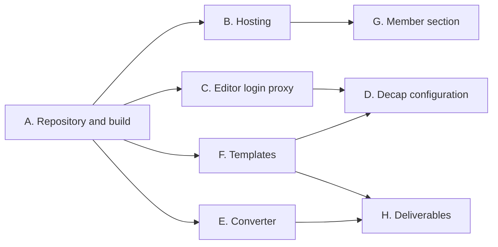

# Roadmap

Implementation roadmap for the git-based prodeko.org described in
[the design document](superpowers/specs/2026-09-18-prodeko-git-cms-design.md).

The target is a working site, not a finished one. Done means an editor signs in
with a Prodeko account, changes a page, and the change appears on a real
address, with real migrated content and a member-only page that cannot be
reached without a login.

## Where the code lives

Three places:

- A new repository, prodeko-org, holding the website. Inside it, `site/` is the
  Hugo site and the Decap configuration, `proxy/` is the editor login service,
  and `tools/migrate/` is the one-off converter from the old database.
- infra-prodeko, for anything that provisions or configures a machine: the
  Caddy configuration, the storage container, DNS, and the proxy container's
  deployment.
- Keycloak at id.prodeko.org, configured by hand through the admin console.
  Production clients there are not managed by a script.

One repository for the website rather than three is a deliberate choice. The
proxy is a few hundred lines and is meaningless without the site it edits, and
a single repository means one pull request when the two change together. The
cost is that editor commits and developer commits land in the same history.
Decap only ever writes to `site/content/` and `site/assets/`, so they stay easy
to tell apart.

## Work items

### A. Repository and build pipeline

Set up prodeko-org with a Hugo site containing one page, and a GitHub Action
that builds it and uploads the result.

Done when a commit to main produces built HTML somewhere another machine can
fetch it.

### B. Hosting

Caddy on prodeko-vm2 serves the built site at a real address, through the
existing Ansible setup. A storage container if credentials are at hand,
otherwise the Action copies files to the VM and Caddy serves from disk. The
swap between the two is small and should not block anything.

Lands in infra-prodeko. Done when the page from item A is reachable over HTTPS.

### C. Editor login proxy

The service that lets Decap use Prodeko accounts instead of GitHub accounts. It
signs the editor in through Keycloak, requires an editor role, holds the GitHub
credentials server-side, and overwrites the commit author with the editor's
name and email.

For the first version this uses a fine-grained access token on a bot account
rather than a GitHub app. Attribution works identically either way, because the
author is a field in the request rather than something derived from the
credential.

Done when an editor signs in and a commit appears in GitHub under their name.

### D. Decap configuration

The editing screen itself: which pages and data files are editable, what fields
each has, and the embed options in the dropdown. Mostly one configuration file
plus a few small editor components.

Depends on the content model from item F being roughly settled.

### E. Content converter

A script that reads the Django database dump and writes Markdown pages, YAML
data files and a list of old address to new address.

The three archive pages matter most: boards from 1967, officials from 2005, and
honours from 1969. Those become data files with one entry per person. The
roughly sixty plain pages are converted best-effort, and some will need hand
tidying.

Done when the real page tree is in the repository in both languages.

### F. Content model and templates

The page types and the design. Three templates cover almost everything: a plain
text page, a grid of people, and a year archive generated from data files. Plus
the navigation as a data file, the embed shortcodes for the existing Prodeko
services, and Finnish and English side by side.

This is the largest item and the one that decides how the site looks, so it
should not be squeezed.

### G. Member-only section

Caddy asks Keycloak who the visitor is and requires the membership role before
serving anything under the members section. The storage container is private,
so there is no public address to guess.

Lands in infra-prodeko alongside item B. Done when a member page returns a
sign-in redirect to a stranger and the page itself to a member.

### H. Written deliverables

The sitemap, the content inventory, the migration plan and the platform
comparison. Most of this falls out of items E and F rather than being separate
work. The content inventory in particular is the converter's output reviewed
page by page.

## Order and parallelism

Item A is small and blocks everything, so it is done first and by one person.
After that, C, E and F run in parallel and barely touch each other. The proxy
knows nothing about templates, the converter writes files nobody else is
editing yet, and the templates can be built against hand-written sample content
until the converter catches up.

B and G belong together and live in a different repository, which makes them a
clean separate track.

D is the one item that waits on two others, because the editing screen has to
describe a content model that exists and log in through a proxy that works.

## Start these now, outside the critical path

Three things need a human with access rather than a developer with time, and
all three block something later:

- Somebody with a member login lists the Proleko back issues and the meeting
  minutes. Nobody outside can see them, and a cutover date cannot be set
  without knowing how much is there.
- A Keycloak client for the CMS, registered in the admin console at
  id.prodeko.org, following the existing guide in the membership-registry
  repository.
- A bot GitHub account and a fine-grained access token scoped to the one
  repository.

## If time runs out

Cut in this order: preview builds on pull requests, the staleness job, image
processing, search, then polish on the templates.

Do not cut the role check in the proxy, the author injection, the repository
pinning in the proxy, or the member gate actually gating. Those four are the
difference between demonstrating the idea and demonstrating a mock-up of it.
