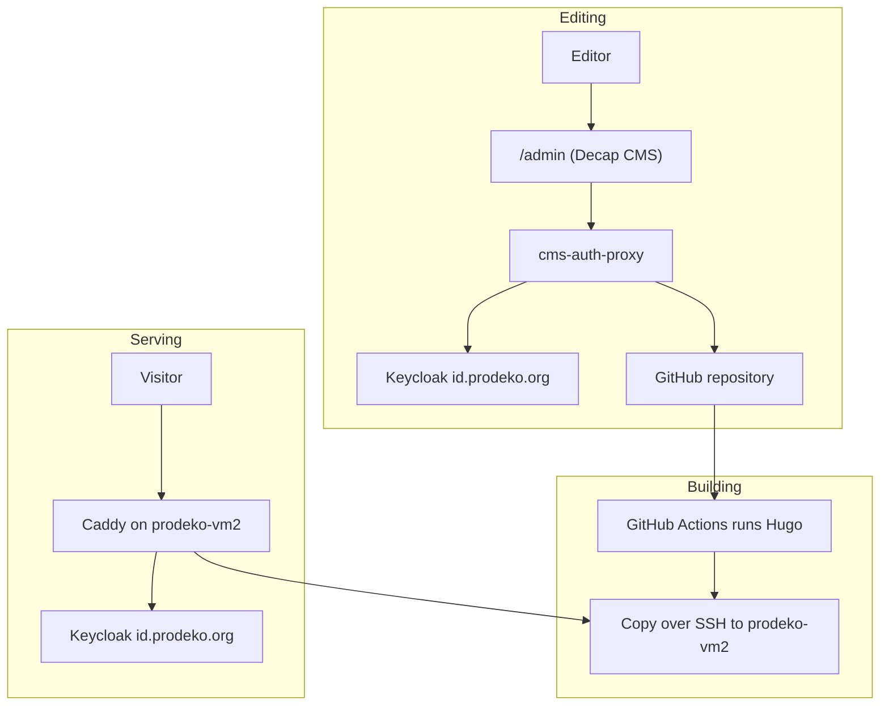
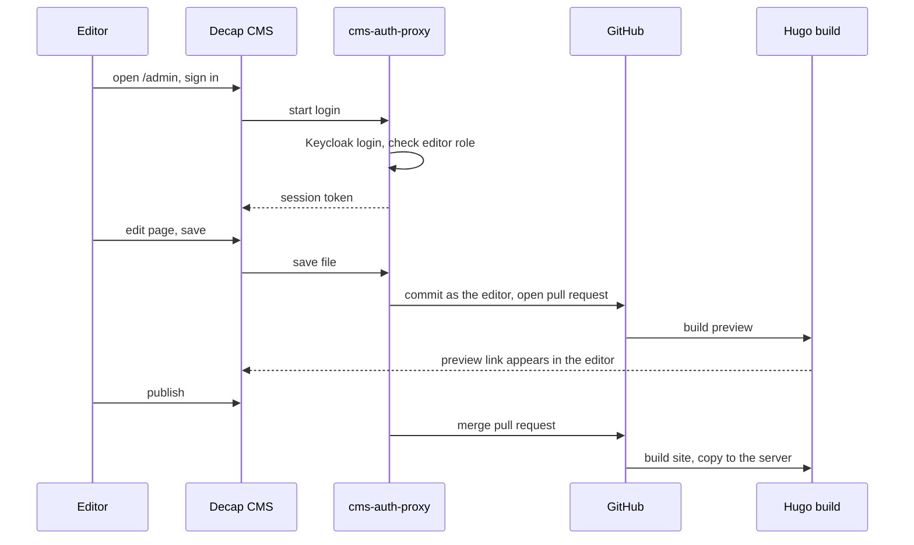
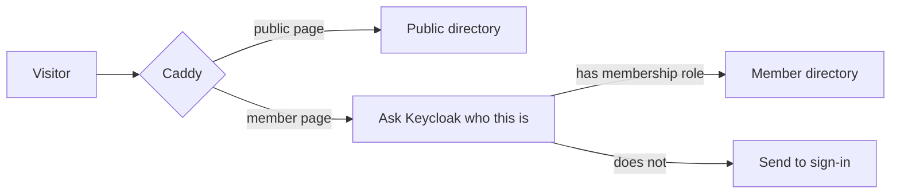
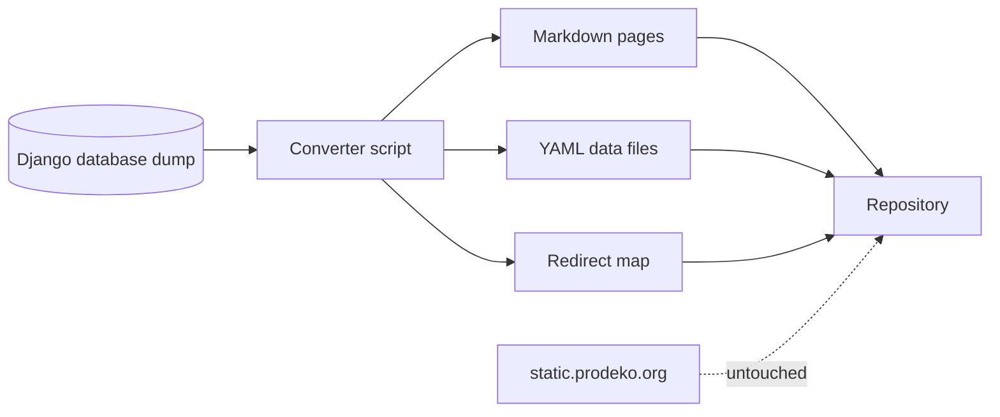

# Prodeko.org: a git-based website

## Summary

The new prodeko.org is a set of text files in a git repository, turned into
plain HTML pages by [Hugo](https://gohugo.io/), copied onto a server, and
served by Caddy, which handles login for member-only pages.

Editors never see git. They log in at prodeko.org/admin with their normal
Prodeko account, edit a page in a browser form, and press save. Behind the
scenes that becomes a commit and a pull request, with their name on it.

Three ideas carry the whole design:

- Content is text files. Pages are Markdown, lists of people are YAML. Git
  gives us history, review and rollback for free, so "no historical content may
  be lost" is a property of the tool rather than a promise in a document.
- The website is only pages. Everything interactive already exists as a
  separate Prodeko service, so the site embeds those instead of rebuilding
  them.
- Looking good is the developers' job, editing is the editors' job. Designers
  change templates and CSS in the repository. Editors change words and photos
  in a form. Neither can break the other.

## Why not keep Django CMS

The current site is Django CMS 3.1 on Django 3.1, both years out of support.
Its content is a tree of database rows, which means the site cannot be edited,
reviewed or restored without a running database and someone who knows Django.

The survey of the live site found the practical cost of that:

- The front page has an Instagram feed that has been silently broken since 2020.
  It calls an interface Facebook shut down, using a key visible in the page
  source. Nobody noticed.
- The Finnish elections page is a redirect chain that ends in a 404.
- The English freshman guide is two years older than the Finnish one.
- The sitemap is missing about ten pages that are in the main menu.
- infoscreen.prodeko.org is switched off and returns an error.

None of these are hard to fix. They stayed broken because nobody can see the
whole site at once. A repository of text files can be searched, diffed and
checked automatically on every change.

## How it fits together



Four pieces:

- The repository holds the site: text, images, templates, styles.
- Decap CMS is the editing screen. It is a single JavaScript file served as
  part of the site, with no server of its own.
- cms-auth-proxy is the only new backend service. It logs editors in against
  Prodeko's existing Keycloak, checks they are allowed to edit, talks to GitHub
  on their behalf, and stamps their name on each commit.
- Caddy on prodeko-vm2 serves the built site from disk and enforces login on
  member-only pages. Prodeko already runs Caddy on this machine under Ansible.

The build lands in two directories. Public pages go where Caddy serves them
freely. Member pages go somewhere Caddy only reads after a successful login, so
they have no public address that could be guessed.

Serving from disk keeps the moving parts to a minimum: the site is a few
megabytes of HTML on a machine Prodeko already runs. There is no content
delivery network and no object storage, because a guild website does not have
the traffic to need either and both cost money every month.

## Editing and publishing



Saving a draft opens a pull request rather than changing the live site. A build
runs against that pull request and publishes a preview at its own address, and
the link shows up next to the entry in the editing screen. Publishing merges the
pull request, which triggers the real build.

This gives previews, a review step before anything goes live, and an exact
record of who changed what, without writing any of it ourselves.

## Login, and how the proxy works

Prodeko already runs Keycloak at id.prodeko.org with the realm
membership-registry and the roles admin, membership and
prodeko-external-member. Both the editing screen and the member-only pages use
it, so there is no second set of accounts and no licence cost.

Decap normally expects editors to have GitHub accounts. It does not have to.
Decap lets you point it at a different address for login and for the GitHub
interface, and it treats the login token as an opaque string without checking
where it came from. That is the gap the proxy fills.

The proxy:

- Logs the editor in through Keycloak and requires the editor role.
- Keeps the GitHub credentials on the server. The browser never sees them.
- Passes through only the handful of GitHub addresses Decap actually needs, for
  one fixed repository.
- Overwrites the author on every commit with the name and email from the
  Keycloak login, so attribution cannot be faked by a modified browser.

This pattern has been built before, by
[CivicDataLab](https://github.com/CivicDataLab/civicdatalab.github.io/pull/316),
with the same combination of Decap, Keycloak and a GitHub app.

Two known rough edges. Decap does not renew an expired login, so the proxy
issues its own session and renews against Keycloak in the background rather
than handing the raw Keycloak token to the browser. And Decap has a local
development mode that bypasses the proxy entirely, which must stay switched off
so that testing exercises the real login path.

Member-only pages work the same way at the other end. Caddy asks Keycloak for
the visitor's identity, requires the membership role, and only then reads the
page off disk.



## What the content looks like

```
content/fi/kilta/arvot.md         pages, one Markdown file each
content/en/guild/values.md
data/boards/1967.yaml             one file per year
data/officials/2026.yaml
data/honours.yaml
data/partners.yaml
data/navigation.yaml
assets/images/                    photos, resized during the build
layouts/                          templates, developers only
```

A page is a short header followed by text:

```markdown
---
title: Arvot
translationKey: values
reviewed: 2026-09-18
owner: viestinta
---

Prodeko on tuotantotalouden opiskelijoiden kilta...
```

The survey found about 95 real pages, of which roughly 60 are plain text of
400 to 700 words. Those are the easy part. The interesting part is the three
pages that are not text at all:

- Previous boards, 1967 to 2025, 58 years of names and roles.
- Previous officials, 2005 to 2025, roughly 2500 people. This is currently one
  page weighing about a megabyte of HTML.
- Honours, 1969 to 2025, around 250 people across four award categories.

Together these hold more text than the other ninety pages combined, and they
are maintained today by hand-editing HTML. As YAML files they become a form
with an add-row button, and the year page is generated from them. This is the
single largest maintenance win in the project.

The same applies to smaller lists: the ten partner companies that appear in
every page footer, the 86 alumni newsletters, the current board and officials.

### Anything interactive is an embed

Nothing interactive gets rebuilt. Each one becomes a one-line embed that an
editor inserts from a dropdown:

- Event signup and calendar: ilmo.prodeko.org
- Weekly bulletin: the existing viikkotiedote app
- Photo gallery: gallery.prodeko.org
- Webshop: store.prodeko.org
- Expense claims: prodeko.kululaskut.fi
- Elections: vaalit.prodeko.org and vaalikoppi.prodeko.org
- Member registry: matrikkeli, which stays a separate service as the brief requires
- Contact and other forms: an external form tool to begin with

The dead Instagram feed is dropped rather than ported.

### Two small additions

Search. Neither prodeko.org nor tietokilta.fi has any. A build-time search
index needs no server: it is a set of static files built from the pages
themselves and served from disk like the rest of the site. The index costs one
build step and one HTML attribute; the search box that reads it is under two
hundred lines of our own. Members search member pages and public pages in one
list, and the build fails if a member page reaches the public index.

A review date. Every page carries a reviewed date and an owning role. A
scheduled job opens an issue for anything untouched for a year. The brief says
the current content is partly outdated, and this is the cheapest thing that
attacks the cause rather than the symptom.

## Migration



The database dump is already available, so the conversion is a script rather
than copy-and-paste. It walks the page tree, turns each page's content blocks
into Markdown, pulls the three archive pages apart into YAML, and writes a list
of old address to new address.

Existing uploads are not migrated. The 86 alumni newsletters, the freshman
guides and the officer photos stay at their current addresses on
static.prodeko.org and are linked from the new site. Not moving them is both
less work and less risk.

Phases:

1. Inventory the member-only archives. Somebody with a member login has to list
   the Proleko back issues and the meeting minutes. This is the one thing
   nobody outside can see, and it blocks a cutover date.
2. Run the converter and review the output page by page. Mark each page keep,
   update or drop, which is the content inventory the brief asks for.
3. Build the templates and the design.
4. Check every one of the roughly 107 old addresses resolves, either directly
   or through a redirect.
5. Switch DNS. The old site stays running until the addresses are verified.

## Platform comparison

| | Hugo + Decap | Django CMS | Webflow | Payload CMS |
|---|---|---|---|---|
| Easy to maintain | Text files, no database | Two unsupported versions behind | Hosted, no upkeep | Needs a database and a server |
| Own login | Yes, via the proxy | Yes, already built | Enterprise plan only | Editors only, no member login |
| Hosting cost | An existing VM | Existing VM | Paid per month, per editor | VM plus a database |
| Customisability | Full, it is our own templates | Full | Limited outside the editor | Full |

Payload is what Tietokilta chose, which makes it worth looking at honestly.
Their site is good in places, and the state of it is also instructive: 27 of 87
pages have not been edited since 2024, four English pages return 404 because of
duplicated address fields, there is no sitemap, no robots file and no search,
every page is rebuilt by the application for every visitor even though almost
all of it is static, and their media library holds seven separate uploads of
the same freshman guide.

Those are not failures of effort. They are what happens when the content lives
in a database that only the running application can see. A repository of files
can be checked by a script on every change, which is the difference this design
is built around.

## Risks

- The member-only archives are unmeasured. Proleko back issues and meeting
  minutes could be a few dozen files or several hundred. Nobody can tell from
  outside.
- The proxy is the one genuinely new thing. The reference implementation notes
  that a full save through the real editing screen had not been tested end to
  end. That is the first thing we prove, not the last.
- Images live in git, which is fine for photos and bad for large documents. The
  current freshman guide is a 90 MB PDF. The build rejects any committed file
  over 5 MB, and large documents stay on static.prodeko.org where they already
  live.
- Event photos are on kuvat.fi, a third-party service. Migrating them is a
  separate question; linking to them is not.
- Editors have to learn a new screen. It is a form rather than a page builder,
  which is simpler, but it is still a change.

## What we build during the hackathon

In priority order:

1. The proxy, end to end. An editor signs in with a Prodeko account, saves a
   page, and the commit appears in GitHub under their name.
2. The converter, run against the real database dump, producing the real page
   tree.
3. The front page and three page types: plain text, a person grid, and a year
   archive built from YAML.
4. One member-only page that is genuinely unreachable without a login.
5. The build and upload, live on a real address.

The design document, the sitemap and the migration plan come out of doing this
rather than instead of it.
