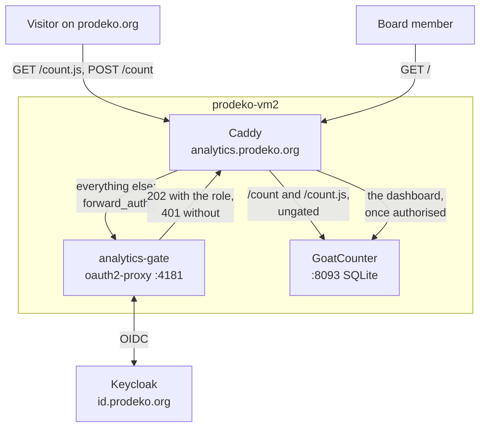

# Page analytics for prodeko.org

## Summary

The site counts its own pageviews with [GoatCounter](https://www.goatcounter.com/),
a single Go binary with a SQLite database, running in one container on
prodeko-vm2 beside everything else Prodeko hosts. The dashboard lives at
`analytics.prodeko.org` behind a Keycloak sign-in. The two endpoints the
counting itself needs are open to everyone, because a gated counting endpoint
counts nothing.

There is no cookie banner, and there should not be one. GoatCounter stores
nothing on a visitor's device, so the rule a banner exists to satisfy is never
engaged. What replaces the banner is a privacy notice that describes what is
actually collected, and a button on that page that switches the counting off.

Three properties carry the design:

- Nothing is stored on the visitor's device. No cookie, no localStorage entry,
  no cache identifier, no fingerprint. This is what makes the consent question
  answerable rather than a matter of taste.
- Nothing identifying is stored on the server. The address and browser string
  are held in memory for at most eight hours to recognise a single visit, and a
  random string goes into the database in their place.
- The member section is not counted at all. Everyone behind that gate is
  identified by name, which is a different question with a worse answer, and
  the two pages there would not repay asking it.

## What the board needs to know

A guild board is a dozen volunteers on year-long terms who will look at this
monthly at best and hand it to strangers in December. Anything whose value
depends on a weekly ritual is dead by spring, which rules out funnels, cohorts,
retention curves and real-time views. Five questions recur, each with a decision
attached.

**Did the abi campaign work?** `content/fi/abit/` and its English pair
`content/en/prospective-students.md` are where the spring campaign points.
Whether the page moved during the joint application window, and where the
arrivals came from, decides whether to repeat the campaign or change it.

**Is the corporate side being found?** `content/fi/yrityssuhteet/yrityksille.md`,
`rekrytointi.md`, `prodeko-network.md` and `laskutustiedot.md` are the pages that
carry money. A recruiter arriving from a search, from LinkedIn, or from a link in
an email Prodeko sent are three different worlds, and yrityssuhteet is the one
board role with an external counterparty who will ask what the site does for
them. The English versions matter more here than the Finnish ones, which is
itself worth knowing.

**Is the fuksi material read in August?** The seven pages under
`content/fi/new-students/` are written once a year for about a hundred and fifty
people over three weeks. If four are read and three are not, next year's
fuksikapteeni should know before rewriting all seven.

**Can people find the pages that must be findable?**
`guild/hairintayhdyshenkilot.md`, `guild/jaseneksi.md`,
`guild/board/hallitus.md`. Low traffic on the harassment contacts page is a
finding rather than a non-event: it means the page is not reachable from where
somebody in trouble would look. This is the one metric whose interesting answer
is a small number.

**Which pages should stop existing?** Around 110 pages across two languages. The
survey behind the CMS design found a sitemap missing ten pages, a feed dead
since 2020 and a redirect chain ending in a 404, all of it surviving because
nobody could see the whole site at once. Traffic is the half of that picture the
repository cannot supply on its own.

### The metric set

Pageviews per path per month, sorted, with the zero-traffic tail visible,
because the tail is where decisions change. Distinct visitors per month.
Referrer, grouped. Language, which on a bilingual site with 55 English pages is
a translation budget question. Country. Device class. Plus outbound clicks on
the embed cards, specified below.

One thing cannot honestly be delivered, and it is better to say so here than to
put a wrong number on a dashboard. Counting *new* visitors means distinguishing
somebody who has been here before from somebody who has not, which requires a
durable identifier — precisely the thing whose absence makes the rest of this
design consent-free. GoatCounter rotates its deduplication salt every eight
hours, so "distinct visitors" means "distinct within eight hours" and
over-counts anyone who returns on another day. The useful form is the
comparison, not the absolute: this August against last August, this abi season
against the last one. That is what a board acts on, and it is available. The
dashboard may carry the absolute number, but the privacy notice and the board
briefing both say what it is.

## Why GoatCounter

The machine decides this. prodeko-vm2 is a `Standard_B2ls_v2`: two vCPUs, 4 GiB
of RAM, a 64 GB disk, already carrying Caddy, the Django site on 8000, ilmo on
5678, cms-auth-proxy on 8092, the member gate on 4180, gatus on 8080 and a
beszel hub and agent on 8090.

GoatCounter is one container, one Go process, one SQLite file in a named volume.
Resident memory is tens of megabytes. Disk grows at roughly 400 MB per million
pageviews, so a guild site accrues on the order of a hundred megabytes a year
against 64 GB and then plateaus once retention applies. The client cost is about
3.5 KB of script, making two scripts on a site that currently ships one.

**Umami** is a Node application plus PostgreSQL: two containers, around 400 MB,
roughly ten times the cost for the same six numbers. Its dashboard is the
prettiest of the field, which is a real argument. Against it, its default
visitor salt rotates monthly rather than every eight hours, and a month-long
deduplication window is a month-long linkability window — a materially weaker
privacy position, and the wrong way round for a design whose consent argument
rests on not being able to follow anyone across days.

**Plausible Community Edition** is three containers including ClickHouse.
Upstream recommends at least 2 GB for the stack, and ClickHouse alone idles near
1 GB and spikes past 2 GB on queries. On this machine that is more than half of
total memory for a page counter, and it fails by the kernel choosing between the
Django site, the member gate and ClickHouse at two in the morning.

**Parsing Caddy's access log** is the most attractive option on principle and
the worst in practice. It needs no script and no consent conversation, and it
genuinely yields paths, referrers, user agents and countries. It fails on
visitors, which is the question actually asked: logs count requests, and gatus
alone contributes 43,200 requests a month before a single human arrives.
Separating people from crawlers in a log is the problem client-side counting
sidesteps by only firing when a browser runs JavaScript. It would also mean
changing `format console` to a machine-readable format for every vhost on the
host at once, and it is the only option that writes raw addresses to disk —
which the privacy notice currently promises it does not do. It stays available
as a developer's diagnostic; it is not the answer to the board's question.

## Architecture



Two routes through one vhost. The tracking endpoints are open, because a
pageview arrives from a stranger's browser and a gate in front of it would mean
counting nothing. Everything else is the dashboard and requires a Prodeko
account holding the `prodeko-org-admin` realm role.

The split is an allowlist of exactly two paths and has to stay one. GoatCounter's
own dashboard setting is public, so oauth2-proxy is the only thing standing in
front of the numbers; any third path that escapes the gate exposes them.

### Caddy

One vhost in `ansible/host_files/prodeko-vm2/Caddyfile.j2`, rendered from the
two roles' defaults so the ports have one source of truth.

```caddyfile
{{ goatcounter_hostname }} {
	import security-headers
	import logging
	encode zstd gzip

	# The tracking endpoints, open to every visitor. /count.js is the script
	# the site loads; /count is where it posts pageviews and the embed-card
	# click events. Both are cross-origin from the site, which needs no CORS
	# configuration: sendBeacon issues a simple POST whose response the
	# browser discards, and the image fallback is no-cors as well.
	#
	# X-Forwarded-For is overwritten rather than appended. GoatCounter derives
	# its eight-hour deduplication token and the country lookup from the
	# client address, and Caddy's default is to append to whatever the client
	# sent — on a public endpoint that lets anyone supply the address they are
	# counted under.
	@tracking path /count /count.js
	handle @tracking {
		reverse_proxy 127.0.0.1:{{ goatcounter_port }} {
			header_up X-Forwarded-For {remote_host}
			header_up X-Real-IP {remote_host}
		}
	}

	# oauth2-proxy owns its own prefix, as on the site vhost. Its own
	# no-store, because a site-level Cache-Control sorts before handle.
	handle /oauth2/* {
		header Cache-Control "private, no-store"
		reverse_proxy 127.0.0.1:{{ analytics_gate_port }} {
			header_up X-Real-IP {remote_host}
			header_up X-Forwarded-Uri {uri}
		}
	}

	# Everything else is the dashboard. The catch-all handle sorts last, so a
	# path that matches neither matcher above lands here and is gated.
	handle {
		header Cache-Control "private, no-store"
		forward_auth 127.0.0.1:{{ analytics_gate_port }} {
			uri /oauth2/auth
			header_up X-Real-IP {remote_host}

			@unauthorized status 401
			handle_response @unauthorized {
				redir * /oauth2/start?rd={http.request.orig_uri.path}
			}
		}
		reverse_proxy 127.0.0.1:{{ goatcounter_port }} {
			header_up X-Forwarded-For {remote_host}
			header_up X-Real-IP {remote_host}
		}
	}
}
```

GoatCounter runs with `-tls http` because Caddy terminates TLS, and with
`-public-port 443` so the origins it builds for its own links and for the
dashboard's WebSocket match the name the browser used. That WebSocket drives the
live chart and its origin check is the known rough edge behind a reverse proxy;
it is the first thing to confirm after the first deploy.

There is no Content-Security-Policy anywhere in the Caddyfile, so loading a
script from a second origin needs no header change. If a CSP is added later it
needs `script-src https://analytics.prodeko.org`.

### The gate

A second oauth2-proxy, in its own role, shaped exactly like `member_gate`.

Three oauth2-proxy instances will eventually run on this host — the member gate,
this one, and the preview gate when previews land. That is the right shape, not
an accident of copying, for two reasons that are specific to this host.

Sharing one instance across vhosts means sharing its session cookie across them,
which means setting a `.prodeko.org` cookie domain. The Caddyfile also serves
`kiltis.prodeko.org`, which reverse-proxies to `86.50.143.132`, a machine
outside this VM. A wildcard session cookie would be transmitted there on every
request. That settles it on its own.

The second reason is authorisation granularity. One instance carries one allowed
role list, evaluated as "any of". The member gate admits `membership`, about a
thousand people. This dashboard admits `prodeko-org-admin`, a handful. Sharing
an instance means the widest of the three wins, so every guild member could read
the analytics dashboard and, once previews exist, every guild member could read
unpublished drafts.

The cost of separation is about 20 MB of resident memory per instance — three of
them together are roughly a seventh of what a single ClickHouse would idle at.

The duplication is real and is worth removing once, later: when the preview gate
is written it becomes the third near-identical role, and that is the moment to
extract a generic `oauth2_gate` instantiated three times with different
variables. Not now. The member gate is working and is one of the four things the
roadmap says must not be cut, and refactoring a live security control under time
pressure to save some YAML is a bad trade.

### The Keycloak client

Registered by hand in the admin console, realm `membership-registry` at
id.prodeko.org. Client id `prodeko-analytics-gate`, OpenID Connect, client
authentication on, standard flow only, PKCE challenge method S256.

One redirect URI, no wildcards:

```
https://analytics.prodeko.org/oauth2/callback
```

One only, unlike the member gate's pair. The dashboard has its own permanent
name, so the cutover from `uusi.prodeko.org` to the apex never touches it — the
same reasoning that gives cms-auth-proxy its own hostname. Web origins stay
empty: this is top-level browser redirects, not cross-origin fetches.

The dedicated client scope needs exactly one mapper, an Audience mapper with
included client audience `prodeko-analytics-gate`, added to both the ID token
and the access token. oauth2-proxy matches the token audience against the client
id, and the callback fails without it with an error that names neither.

It does not need a User Realm Role mapper. oauth2-proxy reads
`realm_access.roles` from the access token, where Keycloak's built-in roles
client scope already puts it as long as "Full scope allowed" stays on. This is
the opposite of what cms-auth-proxy needs, and it is the easiest thing to get
wrong by analogy.

Verify in Client scopes, Evaluate, with a real board account: the generated
access token must contain `prodeko-org-admin` in `realm_access.roles` and
`prodeko-analytics-gate` in `aud`.

### The role that may view the dashboard

`prodeko-org-admin`. That is the realm role `cms_auth_proxy` already requires of
an editor alongside `membership`, so it is known to exist and known to be held by
the people who run Prodeko's digital services.

Two things about it are easy to get wrong. oauth2-proxy evaluates its allowed
roles as "any of", while cms-auth-proxy's `EDITOR_ROLES` means "all of". Copying
`membership,prodeko-org-admin` across by analogy would widen this gate to every
guild member rather than narrowing it.

And the failure is silent in the permissive direction. A misspelt or empty
allowed-role value does not stop anything: oauth2-proxy starts happily and
admits every account that can sign in to the realm. Because the GoatCounter
dashboard is set public behind this gate, that failure reads as "the whole guild
can see the dashboard", not as an error page.

The acceptance test is therefore a negative one and happens before anyone is
told the dashboard is protected: sign in with an account that holds `membership`
but not `prodeko-org-admin`, and confirm it is refused. Refusal is a 403 at
`/oauth2/callback` with `[AuthFailure] Invalid authentication via OAuth2:
unauthorized` in `docker logs analytics_gate`, and no session cookie issued.

The same `email_verified` trap applies as on the member gate: oauth2-proxy
refuses a login whose ID token says the address is unverified, independently of
the wildcarded email domain, and the error explains nothing. Decide it by signing
a real board member in before launch.

### Why the dashboard is public inside GoatCounter

GoatCounter has local accounts only; there is no OIDC. Leaving its own login in
place behind oauth2-proxy means a login inside a login, which defeats the point
of using Prodeko accounts. So the site's dashboard setting is public and
oauth2-proxy is the only gate.

One GoatCounter admin account survives, because settings changes need it. Its
password lives in Key Vault as `goatcounter-admin-password` and it is reached
through the same gated vhost as everything else.

The consequence is that the allowlist is load-bearing, and gatus watches both
sides of it.

### Monitoring

Two checks in `ansible/vars/prodeko_vm.yml`, in the idiom the member gate check
already uses — each measures what the thing does rather than whether a container
is alive.

`analytics-count` asks for `https://analytics.prodeko.org/count.js` and requires
200. That is the path every pageview depends on, and it fails in the quietest
possible way: if it ever ends up behind the gate, the public site's script gets
a redirect, the board's numbers go to zero, and nothing looks broken.

`analytics-gate` asks for `https://analytics.prodeko.org/` anonymously with
redirects disabled and requires 302. It goes red if the dashboard comes open
(200), if the gate container is down (502), or if the catch-all handle stops
matching (404).

## Consent: no banner

The conclusion first: **do not build a cookie banner.** Publish a corrected
privacy notice with an opt-out button instead. The reasoning matters because the
usual "it is cookieless, therefore no banner" shortcut skips a step that really
exists here.

### The two questions are separate, and the order matters

The ePrivacy question comes from Article 5(3) of Directive 2002/58/EC,
implemented in Finland by section 205 of the Act on Electronic Communications
Services (917/2014) and supervised by Traficom. It requires consent before
storing information in, or gaining access to information already stored in, a
user's terminal equipment, unless that is strictly necessary to provide a service
the user explicitly requested. This is the rule a cookie banner exists to
satisfy. Traficom's guidance is explicit that analytics cookies are not strictly
necessary, and that legitimate interest under the GDPR cannot substitute for
consent where section 205 applies.

The GDPR question is separate: is personal data processed, and on what lawful
basis. Helsinki Administrative Court confirmed in March 2023 that Traficom has no
competence over the processing of personal data as such, which belongs to the
Data Protection Ombudsman.

So: answer ePrivacy on the exemption, and the GDPR on legitimate interest.
Answering ePrivacy on legitimate interest is the mistake Traficom names.

### Nothing is stored on the device

No cookie, no localStorage write, no sessionStorage, no cache identifier, no
fingerprint. GoatCounter's script sends the path, the referrer, the title, an
event flag, `window.screen.width`, a bot flag, the query string and a
cache-busting random number, by `navigator.sendBeacon()` with an image-pixel
fallback. There is no canvas fingerprint and no font enumeration.

The storage trigger in section 205 is therefore never engaged, and that is the
trigger a banner exists to satisfy.

### One thing is read from the device

`count.js` calls `localStorage.getItem('skipgc')` on every pageview and sends
nothing at all if it finds `t`. Under the EDPB's Guidelines 2/2023 on the
technical scope of Article 5(3), storing and gaining access are separate
triggers and either alone brings the provision into play, so a bare read of
localStorage is in scope. Anyone claiming this is outside ePrivacy because it is
"cookieless" has not read the script.

It needs no consent regardless, by the exemption rather than by denial. The only
value read is the visitor's own opt-out flag, and reading it is the sole way to
honour the choice the visitor made — the same reasoning that exempts a
consent-preference record, since a refusal cannot be respected without reading
the record of it. The read also fails in the visitor's favour: absent, nothing
about them is learned by it; present, no request is sent at all.

This is why the opt-out button on the privacy page is part of the design rather
than a nicety. It turns the one Article 5(3)-adjacent read into the visible
mechanism by which a refusal is honoured, which is what a banner would have been
for, without the banner.

### The server side

GoatCounter holds the site name, the address and the browser string in memory
for at most eight hours to recognise a single visit, puts a random string in the
database in their place, and writes neither the address nor the full browser
string to disk. Whether that in-memory value is personal data is contested and
not worth settling internally: assume it is, because the assumption costs
nothing. Either way a lawful basis and a notice entry are needed, and neither of
those is a banner.

Legitimate interest under Article 6(1)(f) carries it. This is first-party,
self-hosted, aggregate audience measurement on Prodeko's own machine, shared
with nobody, building no profile, with the identifying inputs discarded within
eight hours. An association wanting to know which of its own pages are read is
close to the textbook case, and the balance is not close.

The honest complication: the EDPB treats tracking based on address alone as a
case where Article 5(3) can apply, on the reasoning that unless an entity can
ensure the address does not originate from the terminal equipment it must take
the Article 5(3) steps. Read at its widest that captures every web server that
observes a source address, which is not how it has been applied, and the EDPB
says in the same passage that applicability does not automatically mean consent
is required because an exemption may apply. What matters here is that the
address is not used to single out a device over time — it is consumed into an
eight-hour token and discarded. That is a property to preserve deliberately.

### Why a banner would be worse than nothing

It would be the only cookie banner on a site that sets no cookies. It would ask
for consent that is not required, which is misleading and invites the inference
that something is hidden. It would put an interstitial on first paint of a site
whose whole argument is that it is fast, minimal and static. Refusal would
disable something that was never a burden.

A banner is also not free to get right: refusal must be as easy as acceptance,
consent must be withdrawable, the user must not be nudged, and withdrawal must
remove what was stored. A banner built because it seemed polite is a compliance
liability that nothing else on this site creates.

### What the public tree looks like today

Confirmed, and worth preserving: the public tree makes zero third-party requests
and sets zero cookies. Fonts are self-hosted through
`assets/css/tokens/fonts.css`. Every interactive service is a link card rather
than an iframe — `layouts/partials/embed.html` makes framing opt-in per service
through `data/embeds.yaml`, and no service sets `frame: true`, because they all
send `frame-ancestors 'self'`. So no other embed independently triggers a banner
requirement. GoatCounter keeps that property; most alternatives would not.

## The privacy notice

`content/fi/tietosuoja.md` and `content/en/privacy-policy.md` carry four
statements that do not describe this site, and correcting them is required
whatever happens with analytics.

Section 2 says server log data is not used for analytics, advertising or
identifying users. That stays true under this design and is left alone.

Section 3 lists Google Analytics and Google AdWords among the external
processors. Both are removed from the list.

Section 3's "Evästeiden käyttö" paragraph says that by using the services the
visitor accepts that cookies may be stored. Consent by use is not valid consent
under section 205, and it describes cookies this site does not set. It is
replaced by a statement that the site sets none.

Section 5's **www.prodeko.org** entry says traffic is monitored with Google
Analytics and that the site uses AdWords for targeting. This is the entry that
gets rewritten.

### Replacement wording, section 5

Finnish:

> Sivuston kävijämääriä seurataan Prodekon omalla palvelimella toimivalla
> GoatCounter-ohjelmistolla. Se ei tallenna laitteellesi evästeitä eikä muuta
> tunnistetta, eikä tietoja luovuteta millekään kolmannelle osapuolelle.
> Jokaisesta sivunäytöstä tallennetaan sivun osoite, edellinen sivu jolta
> saavuit, selaimen ilmoittama kieli ja tyyppi, näytön leveys sekä karkea
> sijainti maan tarkkuudella. Lisäksi laskemme, kuinka monta kertaa sivuilla
> olevia linkkejä Prodekon muihin palveluihin, kuten ilmoittautumiseen tai
> verkkokauppaan, on avattu; näistä tallentuu vain linkin kohde ja ajankohta.
>
> IP-osoitettasi ei tallenneta: sitä säilytetään enintään kahdeksan tunnin ajan
> palvelimen muistissa yhden käynnin tunnistamiseksi, minkä jälkeen se häviää.
> Emme siis voi tunnistaa sinua emmekä seurata käyntejäsi päivästä toiseen.
> Kirjautumista vaativia jäsensivuja ei seurata lainkaan. Tiedot poistetaan 24
> kuukauden kuluttua.
>
> Käsittelyn oikeusperuste on rekisterinpitäjän oikeutettu etu
> (tietosuoja-asetuksen 6 artiklan 1 kohdan f alakohta): kilta haluaa tietää,
> mitkä sen omista sivuista ovat käytössä ja mitkä eivät.
>
> Voit kieltää laskennan alla olevalla painikkeella. Painike tallentaa
> selaimeesi yhden merkinnän, jonka ainoa tehtävä on estää laskenta tällä
> laitteella.

English:

> Visitor numbers on this site are counted by GoatCounter, running on Prodeko's
> own server. It stores no cookie and no other identifier on your device, and
> the data is not passed to any third party. For each page view we record the
> address of the page, the page you arrived from, the language and type your
> browser reports, the screen width, and an approximate location at country
> level. We also count how many times the links on these pages to Prodeko's
> other services, such as event sign-up or the webshop, have been opened; of
> those, only the link's destination and the time are recorded.
>
> Your IP address is not stored: it is held in the server's memory for at most
> eight hours in order to recognise a single visit, and is then gone. We
> therefore cannot identify you and cannot follow your visits from one day to
> the next. Member pages behind a login are not counted at all. The data is
> deleted after 24 months.
>
> The lawful basis is the controller's legitimate interest (GDPR Article
> 6(1)(f)): the guild wants to know which of its own pages are used and which
> are not.
>
> You can opt out with the button below. It stores one entry in your browser
> whose only purpose is to stop the counting on this device.

The button reads "Älä laske käyntejäni" and "Don't count my visits", switching to
"Käyntejäsi ei lasketa" and "Your visits are not counted" once set. It is a
shortcode, `layouts/_shortcodes/analytics-optout.html`, about eight lines that
toggle `localStorage.skipgc` and reflect the current state. This is the second
script on the site and it is the honest cost of not having a banner.

The footer already links the privacy page from every page through `$privacy` in
`layouts/partials/footer.html`, so no navigation changes.

## The member section is not counted

The script never renders in the member tree. Four reasons, in descending weight.

The measurement is worth nothing. The tree is an index and a minutes page per
language. No board decision turns on how many members opened the minutes.

The privacy question is different and worse. Everyone past that gate is
authenticated: oauth2-proxy has established a Keycloak identity and confirmed the
`membership` role before Caddy serves a byte. GoatCounter would not receive the
identity, but the population is small and enumerable, the readership of a given
set of minutes smaller still, and a pageview count with a timestamp sitting on
the same machine as the gate's session logs under the same controller is a
re-identification path that does not exist on the public side.

It would break the clean legal story. The no-banner argument rests on processing
that singles nobody out. Counting an identified population is a different
operation with a different risk profile, needing its own notice entry, its own
balancing test and possibly a different answer.

It would weaken a safety property the build already has. `check-trees.sh` exists
to guarantee the two trees cannot contaminate each other, and a partial that must
render in one and not the other is one more thing that can fail silently toward
leaking.

### How it is enforced

The partial renders only when three things hold: the endpoint parameter is set,
`hugo.IsProduction` is true, and `site.Params.members` is not.

The first keeps a fork or a pull-request build silent. The other two both
exclude the member tree, deliberately. Both `config/members/hugo.toml` and
`config/development/hugo.toml` set `members = true`, so the third condition
covers the member build and the local preview together, while
`hugo.IsProduction` covers `hugo server` and, because the member build runs
under `--environment members`, covers that too. Either of the two would exclude
the member tree on its own; both are present because this is the sort of guard
that should not rest on one fact staying true.

`check-trees.sh` gains an assertion in the idiom of the checks already there: the
analytics hostname appears nowhere under `public-members/`. The existing loop
checks that the public tree does not name member paths; this is the mirror,
checking that the member tree does not name the counting endpoint. It runs in CI
with the rest.

If the board later asks whether the members' section is used at all, the honest
and sufficient answer is the count of successful sign-ins through `/oauth2/` per
month, which oauth2-proxy already logs, which is a fact about the section rather
than about anyone's reading, and which collects nothing new.

## Outbound clicks on the embed cards

Every interactive Prodeko service appears on the site as a card with an "Avaa
palvelu" button, rendered by `layouts/partials/embed.html` for all seven
services in `data/embeds.yaml` — ilmo, viikkotiedote, gallery, store,
kululaskut, vaalit and vaalikoppi. Whether anyone presses those buttons is the
one question the pageview count cannot answer and the events page exists to
raise.

GoatCounter binds click events to any element carrying
`data-goatcounter-click`, with `data-goatcounter-title` for the label. The
attribute goes on the button anchor in the partial, and the event name is
derived from the destination host so no shortcode needs editing:

```go-html-template
{{ $host := (urls.Parse $url).Host }}
<a class="btn btn-primary" href="{{ $url }}" target="_blank" rel="noopener"
   data-goatcounter-click="embed-{{ $host }}"
   data-goatcounter-title="{{ $label }}">
```

That yields `embed-ilmo.prodeko.org`, `embed-store.prodeko.org` and so on, all
seven services from one edit to one file. Every card goes through this partial,
including the two services reached by the generic `embed` shortcode rather than
one of their own.

The event records which service was opened, not which page it was opened from. If
the board later wants the latter — which page actually sends people to ilmo — it
is one more attribute, `data-goatcounter-referrer` set to the page's permalink.
That is not in scope here, because it is another thing collected and therefore
another line on the privacy notice.

Click tracking lives in `count.js`, which loads only in the public production
build, so member pages carry no click tracking either.

## Retention

Twenty-four months. The comparison a guild acts on is year over year — this
August against last August, this abi season against the last — and 24 months is
the shortest window giving one such comparison with margin. Longer is hoarding
against a question nobody asks.

GoatCounter enforces it itself, through the data retention setting in the site's
own settings, which purges pageviews past the cutoff. The setting lives in the
database rather than in a flag, and there is no CLI for it: `goatcounter db`
exposes `create`, `update`, `delete` and `show` for the site, user and apitoken
tables, with flags for vhost and linking only, and its own help says not all
columns are settable. So this is a step in the runbook, applied once through the
dashboard, persisting in the SQLite volume across restarts and redeploys.

The consequence is that it can drift from the number printed on the privacy
notice without anything complaining. The number therefore appears in three
places — the role README, the privacy notice, and the handover checklist — and
is confirmed on the running instance thirty days after launch, when the first
purge would have had something to do.

No cron job. Building one to enforce a setting the application already enforces
would be a second source of truth for the same number.

## Backups

The data is one SQLite file in a named docker volume. There is no host backup
role in infra-prodeko, and this feature does not justify writing one: analytics
data is the least valuable data on the machine, and losing it costs a comparison
and nothing else. If a backup arrangement appears later, a nightly
`sqlite3 .backup` belongs in it. Backup design does not block this deploy.

## Changes in this repository

`site/hugo.toml` — a `[params]` block carrying the counting endpoint, empty by
default so a fork, a preview build or a pull-request build stays silent.

`site/layouts/partials/analytics.html` — new. Renders the script tag under the
three conditions above, with a comment saying why all three are there.

`site/layouts/baseof.html` — one line calling the partial, beside the existing
`mega-menu.js` block.

`site/layouts/partials/embed.html` — the two click attributes on the button
anchor.

`site/layouts/_shortcodes/analytics-optout.html` — new, the opt-out button.

`site/content/fi/tietosuoja.md` and `site/content/en/privacy-policy.md` — the
section 5 rewrite above, Google Analytics and AdWords removed from the section 3
processor list, the consent-by-use cookie paragraph replaced, and the opt-out
shortcode inserted.

`site/check-trees.sh` — the assertion that the analytics hostname appears nowhere
under `public-members/`.

`README.md` — two sentences in the existing register: what is counted, and where
the dashboard is.

`.github/workflows/build.yml` is untouched. Nothing here affects the build.

## Changes in infra-prodeko

A new `ansible/roles/goatcounter/` shaped like `gatus`, which is the closest
existing template: one container, driven by defaults, bound to loopback, fronted
by Caddy, owned by a systemd oneshot so a reboot brings it back. That means
`defaults/main.yml`, `handlers/main.yml`, `tasks/main.yml`, `tasks/compose.yml`,
`tasks/service.yml`, `templates/docker-compose.yml.j2`,
`templates/goatcounter.service.j2` and a `README.md` with the defaults table the
other roles carry. Port 8093, with the house-style note that 8000, 4180, 5678,
8080, 8090 and 8092 are taken by prodeko_org, member_gate, ilmo, gatus, beszel
and cms_auth_proxy. The image is pinned by tag and digest together, following
`member_gate` rather than `gatus`, because this container is internet-facing.

A new `ansible/roles/analytics_gate/` copied from `member_gate`, with the same
file set including `tasks/assert.yml`, the same `.env` rendered `0600` under
`no_log`, and the same loopback-only publish. Port 4181; 4182 is reserved in the
comment for the preview gate. The assert names the two Key Vault secrets in its
failure message the way `member_gate` does.

`ansible/host_files/prodeko-vm2/Caddyfile.j2` — the vhost above.

`ansible/vars/prodeko_vm.yml` — `goatcounter_hostname:
analytics.prodeko.org`, three `kv_secret_map` entries, and the two gatus checks.

```yaml
  analytics_gate_keycloak_client_secret: analytics-gate-keycloak-client-secret
  analytics_gate_cookie_secret: analytics-gate-cookie-secret
  goatcounter_admin_password: goatcounter-admin-password
```

`ansible/playbooks/prodeko_vm.yml` — two roles, after `caddy`:

```yaml
    - role: goatcounter
      tags: [goatcounter]
    - role: analytics_gate
      tags: [analytics_gate, goatcounter]
```

The gate runs after GoatCounter, which is the right way round: in the gap the
dashboard answers 502 rather than opening, while `/count` works from the moment
GoatCounter is up.

## In the owner's hands

In dependency order. Steps 1 and 2 are on today's critical path and nothing on
the machine can be finished without them.

**1. DNS.** An A record for `analytics.prodeko.org` pointing at prodeko-vm2's
public address. First, because propagation takes time and Caddy cannot obtain a
certificate until the name resolves. Blocks everything.

**2. The Keycloak client.** Registered by hand at id.prodeko.org per the
specification above: `prodeko-analytics-gate`, confidential, standard flow, PKCE
S256, the single redirect URI, empty web origins, and the Audience mapper on
both tokens. Verify with Client scopes, Evaluate. This yields the client secret
that step 3 needs, and the `analytics_gate` role asserts on that secret before it
touches the host, so **the play cannot run to completion until this exists**.

**3. Key Vault.** Three secrets in `prodeko-vault`:

```
analytics-gate-keycloak-client-secret   # credentials tab of the client above
analytics-gate-cookie-secret            # must decode to exactly 16, 24 or 32 bytes
goatcounter-admin-password              # generated
```

The cookie secret:
`python3 -c 'import os,base64;print(base64.urlsafe_b64encode(os.urandom(32)).decode())'`.

**4. Run the play.**
`ansible-playbook playbooks/prodeko_vm.yml --tags goatcounter,analytics_gate,caddy`

**5. Create the GoatCounter site**, once the container is up:
`docker exec -it goatcounter goatcounter db create site -vhost=analytics.prodeko.org -user.email=mediakeisari@prodeko.org`

**6. Three dashboard settings.** Set the dashboard public, so oauth2-proxy is the
only gate. Set data retention to 730 days. Set ignore-IPs to the guild room's
address if there is a stable one.

**7. The negative acceptance test, before telling anyone the dashboard is
protected.** Sign in with an account holding `membership` but not
`prodeko-org-admin` and confirm a 403. A permissive misconfiguration is silent
and the dashboard is public behind the gate, so this test is the only thing that
distinguishes a working gate from an open one.

**8. Sign a real board member in**, to settle the `email_verified` question
before launch rather than during.

Two things remain genuinely undecided and do not block the work:

**Who signs off on the privacy notice rewrite.** It is a content edit in this
repository and also a legal document with a modification date and a named
controller contact. A developer should not quietly rewrite it. Does the date
move, and does the mediakeisari approve the wording?

**Whether the current prodeko.org still runs Google Analytics and AdWords.** The
notice says so. If it does, the cutover removes both, which is an outcome worth
stating in the migration plan rather than leaving as a side effect — and if any
of those properties outlive the cutover, the notice has to stay accurate for
them meanwhile.

One door is deliberately left open. When the review-date job described in the CMS
design is built, it can sort its issue list by last-thirty-days traffic, which
turns one axis into two: a stale page with traffic is doing active damage, a
stale page with none can be deleted. GoatCounter exposes per-path counts over
both a JSON API and a CSV export, and the API is the interface to build against,
because the job wants a date range rather than a whole-site dump. Not in scope
here.

## Risks

The gate fails permissively and silently. A wrong allowed-role value admits the
whole realm, and because the dashboard is public behind the gate that reads as
"everyone can see the numbers". Step 7 is the mitigation and it is not optional.

The allowlist has two failure directions. Too wide and the dashboard is exposed;
too narrow and `/count` is gated, at which point the site's script silently gets
a redirect, the numbers go to zero, and nothing looks broken. Both gatus checks
land in the same change as the vhost, not afterwards.

The audience mapper is the classic silent trap. Without it the callback fails at
its last step with an error naming neither the client nor the mapper.

A Keycloak outage takes the dashboard down but not the counting, because
oauth2-proxy exits at startup when OIDC discovery fails while `/count` does not
pass through it. That is the right way round and is a deliberate property of the
split rather than luck.

Retention can drift from the privacy notice, because it is a database setting
with no CLI and nothing compares the two.

A third oauth2-proxy is one more copy of a role that should eventually be
generic. The preview gate is the moment to extract it.
