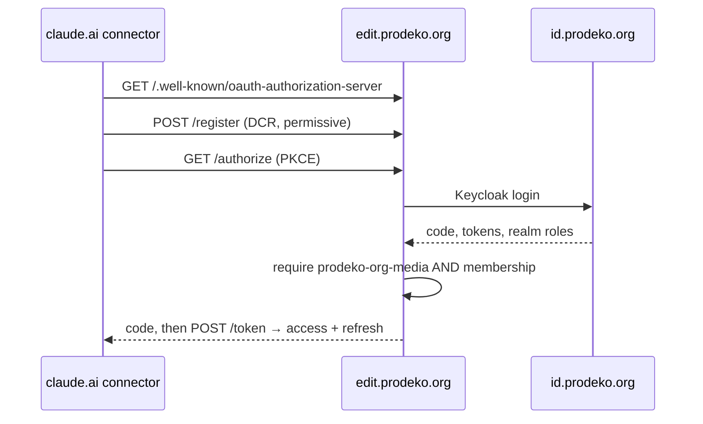
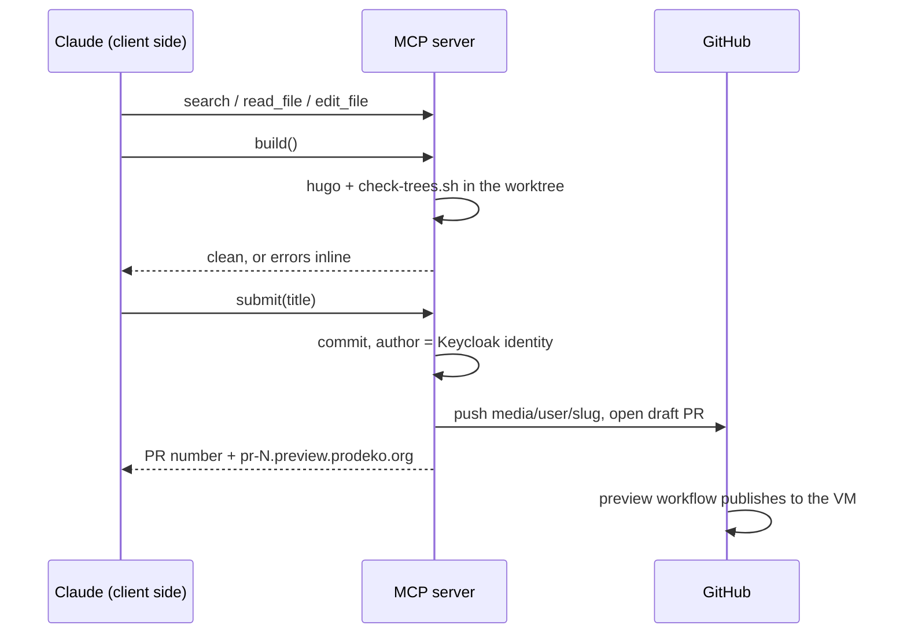

# Content editor MCP server

The media team connects the Claude they already use — claude.ai, Claude
Desktop, or Claude Code — to `https://edit.prodeko.org/mcp`, signs in with
their Prodeko account, and asks for site changes in plain language: markdown,
data files, CSS. Every change lands as a draft pull request under their own
name, with a preview link at `pr-<N>.preview.prodeko.org` they can click.
Publishing stays a maintainer's merge.

This fills the gap Decap leaves open. Decap edits structured content; it
cannot touch a stylesheet or explain why a heading is the colour it is. The
MCP server hands an AI assistant file-level access to a fenced slice of the
repository, with the build as its feedback loop and the pull request as the
safety boundary.

The site itself is described in
[the main design document](2026-09-18-prodeko-git-cms-design.md); previews in
[the preview design](2026-09-19-pr-previews-design.md). This feature
instantiates existing patterns a third time: the proxy's Keycloak sign-in and
sealed sessions, the preview pipeline unchanged, a small Go service in Docker
behind Caddy on prodeko-vm2.

## Where the intelligence lives

The media person's own Claude does the editing; the server is hands and
guardrails. The server never calls a model. It runs the deterministic
expensive work — `hugo`, `check-trees.sh`, git — and enforces the boundaries.

This follows from the security model, not just from cost: the model is a
keyboard, not a trusted component, whichever side it runs on. What contains it
is the path allowlist, the branch namespace, and review before merge. A
server-side agent would buy no safety and cost an agent platform, an API key
Prodeko pays for, and a concurrency story. Tokens are spent from each media
person's own Claude plan.

## The tools

Nine tools. File-level, because CSS is file-level — `update_page(slug, body)`
cannot express "make the events header blue", and once file tools exist,
semantic content tools are a second way to do what Decap already does.

| Tool | What it does |
|---|---|
| `get_conventions()` | The tree layout, the bilingual model, the token layer, what is editable and what is not and why. |
| `list_files(glob?)` | The allowlisted tree. Small enough (≈210 files) to return whole. |
| `read_file(path, start?, end?)` | Ranged. `main.css` is ~15k tokens; reading it whole every turn is the dominant token cost of a session. |
| `search(pattern, glob?)` | Grep. How the model answers "where is this styled". |
| `write_file(path, content)` | Within the allowlist, within the size limits. |
| `edit_file(path, old, new)` | Exact-string replace; the cheap path for CSS edits. |
| `build()` | `hugo` plus `check-trees.sh`, errors returned inline. |
| `submit(title, description?)` | Commit, push, draft PR. Returns the PR number and the preview URL. |
| `list_my_changes()` | The caller's open branches and PRs, CI state, preview links. |

`build()` is the tool that makes vibe-coding work rather than flail. A full
dev build of the site takes ~220 ms, so the server runs it after every write
and hands compile errors straight back — a typo'd shortcode or unclosed
template action surfaces in the same turn that made it, not a minute later in
CI. The command line is fixed. There is no `run_command`, no package install,
no arbitrary fetch; that line is what keeps this a content editor rather than
remote code execution with extra steps.

Site conventions ride in the MCP `initialize` instructions and the tool
descriptions — the two content roots, `translationKey` pairing, "prefer the
tokens in `assets/css/tokens/` over new hex values", "a change to a Finnish
page usually wants its English pair". `get_conventions()` repeats them for
clients that ignore instructions. Convention is advice, not enforcement; the
enforcement layer is the allowlist and review.

## Identity and auth

The server is its own OAuth 2.1 authorization server, wrapping Keycloak — the
same shape as the editor proxy, which already implements the Keycloak code
flow, the realm-role conjunction, and AES-GCM sealed self-contained sessions.
Making Keycloak the AS directly would hang the feature on dynamic client
registration or hand-registering claude.ai's redirect URIs in the production
admin console; keeping the AS in our Go keeps the role semantics where they
are already written and tested.

- **Role:** a new realm role `prodeko-org-media`, required in conjunction
  with `membership`. All roles required, not any — hand-granted edit rights
  lapse on their own when someone stops being a member. `prodeko-org-admin`
  is not reused; it would also grant analytics, the Decap editor and the
  admin surface.
- **Sessions:** unlike Decap's one-tab tokens, an MCP connector lives for
  weeks. Access tokens are short-lived and a real refresh grant renews them.
  The session store's revocation gets a mounted endpoint and an admin list of
  live sessions — the capability exists in the proxy's session package today
  with no route calling it.
- **Commit author:** `Name <email>` from the verified Keycloak identity,
  never from the client. The committer is a distinct bot identity so media
  commits and Decap commits are distinguishable in history.

The claude.ai remote-connector OAuth specifics — which plan tiers can add a
custom connector, whether dynamic client registration is required, what
redirect URIs arrive — are the design's biggest unknown and the first spike.
Being our own AS helps here: we can implement DCR as permissively as the
connector needs.

## The git model

The server holds a clone and opens a `git worktree` per change — a real tree,
because `build()` needs one. The GitHub data API that suffices for Decap does
not suffice here.

- Branch `media/<keycloak-username>/<slug>`, a namespace distinct from the
  Decap flow's, based on `origin/main` at first write.
- No auto-rebase. A push or merge conflict fails loudly with "this change is
  out of date, start a new one". A media person is never asked to resolve a
  conflict; a maintainer resolves the rare collision between two open PRs.
- The push credential is a second fine-grained token on a second bot account,
  same repo. Attribution comes from the author field, so this costs nothing
  and lets media access be revoked without signing out every Decap editor.
- Never force, never outside `media/<user>/`, never `main`.
- The PR opens as a draft, labelled `media`, its body naming the editor and
  the touched files. Draft-on-open is what fires the preview build.
- No merge tool exists in the API — but that is only our code being polite.
  The real boundary is branch protection on `main` requiring one approving
  review. The Decap proxy's allowlist permits the merge call, which is how a
  Decap editor publishes, so the requirement puts a review step in front of
  Decap publishing as well; that trade is accepted.

## Previews

Reused unchanged. The preview workflow triggers on any same-repo pull
request with no path filter, so a `media/*` draft PR gets
`https://pr-<N>.preview.prodeko.org/` with zero workflow changes, in about a
minute. `submit()` constructs the URL from the PR number and returns it
immediately with "ready in about a minute".

The preview gate requires `prodeko-org-admin`, which media do not hold.
`preview_gate_required_role` widens to accept `prodeko-org-media` as well —
the preview design already names that widening as a one-variable change.
This shows media the drafts of member content; since every media member holds
`membership` and can read the published material already, the increment is
small, and it is accepted here explicitly.

A faster inner loop — the server publishing `draft-<id>.preview.prodeko.org`
in ~3 s by building only the public tree and reusing the wildcard cert, the
gate, the forced command and the GC that previews already have — is the first
follow-on, not part of the MVP. What stays rejected in every version: serving
previews from `edit.prodeko.org` itself, which would put author-controlled
HTML on the OAuth origin.

## The fence

One allowlist governs read and write both; outside it nothing is legible.

```
allowed   site/content/**        site/content-members/**
          site/data/**           site/assets/css/**
          site/assets/images/**
          site/layouts/**        (read-only)
denied    everything else, explicitly including
          .github/**             site/hugo.toml, site/config/**
          site/check-trees.sh    site/static/admin/**
          proxy/**  tools/**  docs/**
```

- **`.github/**` is the deny that matters most.** The preview workflow runs
  on same-repo PRs with the preview deploy key in scope; a media-authored
  workflow edit is a direct path to the VM. Nothing else on the list is close.
- **`site/hugo.toml` and `site/config/**`** hold `unsafe = true`, the
  static-dir wiring and the public/member split — the settings that decide
  what the build is allowed to do.
- **`site/static/admin/**`** is the Decap configuration: what *editors* may
  write. Media editing the editors' permissions would be privilege escalation
  by YAML.
- **`site/layouts/**` is readable but not writable.** Read access is
  necessary even for CSS work — "the events header" only resolves to a
  selector by reading the template. Write access would make this a second
  developer interface and break the main design's promise that editors and
  developers cannot break each other's half; it stays a follow-on, gated on
  the `[security]` lockdown below and a sandbox spike, and on actually
  wanting that.
- Mechanical limits: no file over 5 MB (the main design already promises
  this), at most 50 files and 2 MB of text per change, three open changes per
  person, a per-session rate limit, ten seconds of wall clock around `hugo`.
  Paths are validated with the same segment discipline as the proxy's GitHub
  allowlist: no `..` literal or encoded, no control characters, no symlink
  escapes.

**`hugo.toml` gains a deny-by-default `[security]` block** as part of this
feature, independent of the layouts question. Hugo's defaults let templates
fetch remote resources and read files and environment variables; ten lines of
configuration close that, and the file sits on the deny list so the closure
cannot be edited away. The exact reachable surface gets verified by test
before any layouts-write follow-on.

**The honest worst case** is not in the tool layer at all: markdown renders
with `unsafe = true`, so a malicious merged page is full XSS on the
`prodeko.org` origin — where Decap keeps editor session tokens in
localStorage. The control is review before merge, and the spec says so
plainly rather than pretending a lint would catch it. A CI check flagging
`<script>` added by a `media`-labelled PR is a cheap review aid, not a gate.

A compromised media account can open PRs inside the fence and burn CI
minutes. It cannot merge, touch workflows, read a secret (the repo holds
none), reach the VM, or write outside `site/`.

## Runtime

A second binary in the existing `proxy` Go module — `cmd/mcp/` beside
`cmd/proxy/`, sharing the `config`, `session` and Keycloak half of the `auth`
packages. Not an extension of the proxy binary: an OAuth AS with worktrees on
disk is a different failure domain from a browser-facing CORS forwarder, and
two components honestly named beat one doing two jobs. Not Node: a second
language and supply chain on the VM, for an SDK advantage that evaporates
given the server shells out to `hugo` and `git` either way.

Streamable HTTP MCP at `https://edit.prodeko.org/mcp`, behind Caddy, one
replica, deployed by a new `prodeko_mcp` Ansible role modelled on the
proxy's. One property the proxy never had: state. Clones and worktrees live
on a volume with a disk quota and worktree garbage collection. Nothing needs
backup; everything on that disk is reconstructible from git.

DNS: `edit` A record beside `cms`, TTL 3600 — the name is permanent, and it
still reads right if it later grows the image-upload page.

### What changes where

In infra-prodeko: the `edit` A record in Terraform; the `prodeko_mcp`
Ansible role (compose file, rendered `.env` with the Keycloak client
secret, session secret and GitHub token from the vault, image pinned by
digest, the worktree volume with a disk quota); a Caddy site block
`edit.prodeko.org → 127.0.0.1:8093` with no forward_auth, because the MCP
server is the authentication there; the preview gate's required role
widened to a list accepting `prodeko-org-admin` or `prodeko-org-media`
(oauth2-proxy treats the list as any-of); a gatus check on `/healthz`; the
role wired into the VM playbook under an `mcp` tag.

By hand, host-side: the Keycloak confidential client and the
`prodeko-org-media` role in the admin console; the second bot account's
fine-grained token into the vault; branch protection on `main` requiring
one approving review — accepted, together with the review step it adds to
Decap publishing.

In prodeko-hack: `cmd/mcp/` beside `cmd/proxy/` with `config`, `session`
and the Keycloak half of `auth` factored into shared packages; the
`[security]` block in `hugo.toml`; the `media` PR label.

### The connect flow



### The edit flow



## A session, end to end

Maija from viestintä adds the connector in claude.ai, signs in at
id.prodeko.org, and asks for a blue events-page heading with different
wording. Claude reads the instructions, `search`es for the page, reads it,
reads the template to learn which class the heading carries, `search`es the
CSS, makes an `edit_file` using an existing colour token, and gets a clean
`build()` back in the same turn. `submit("Sininen otsikko tapahtumasivulle")`
returns draft PR #47 and the preview link; a minute later she is looking at
it through the preview gate. "Vähän vaaleampi" repeats the loop onto the same
branch. A maintainer sees a one-hunk draft PR labelled `media` with green
checks and a preview link, reviews, merges; the site deploys.

Where it breaks down, honestly:

- **Images.** The model has no file bytes to give `write_file`. The MVP
  defers images to Decap, which handles them today. The planned answer is a
  one-page upload form on `edit.prodeko.org` reusing the same session,
  returning a path to paste into chat — sidestepping the model entirely,
  because models are bad at binary. Not a URL-fetch tool; that is SSRF with
  an allowlist bolted on.
- **Design drift.** Nothing stops a raw hex value; instructions discourage
  it and review catches it. A CI lint flagging hex outside `tokens/` is a
  follow-on.
- **Language parity.** Nothing forces the English pair to move with the
  Finnish page. Instructions tell the model to offer both; review sees the
  file list.
- **Two logins.** The MCP session and the preview gate are separate sessions
  on separate hosts, by design. Mildly annoying, correct.

## What could still kill or reshape this — spikes first

1. **claude.ai connector OAuth, against a throwaway server.** Plan-tier
   availability, DCR requirements, redirect URIs. This one can kill the
   design; nothing gets built before it passes.
2. **Go MCP SDK maturity** for streamable HTTP with auth hooks. Fallback is
   hand-rolled JSON-RPC over POST, ~300 lines, within house taste.
3. **Hugo's template capability surface, by test**, and the `[security]`
   block that denies exactly what proved reachable.
4. **Token cost of one realistic CSS session**, deciding whether ranged
   reads are load-bearing or nice-to-have.

## MVP and follow-ons

The MVP is the server at `edit.prodeko.org/mcp` with OAuth and the role
conjunction, the nine tools, the fence, `media/<user>/<slug>` draft PRs with
Keycloak-authored commits, preview links from the unchanged PR pipeline, and
the `[security]` block. Four things do not get cut even for a demo, because
without them the demo demonstrates a vulnerability: the OAuth role check, the
`.github/**` deny, author-from-identity, and the branch namespace with no
merge capability.

Safe to cut for a demo: `search` and `list_my_changes`, refresh tokens, rate
limits.

Follow-ons, in order: the `draft-<id>` fast preview host; the image upload
page; refresh-token rotation with the revocation endpoint and admin session
list; layouts write access behind the sandbox spike; the design-token lint;
a `check()` tool running the full site audit.

## The alternative, taken seriously

Give the media team Claude Code, GitHub accounts on a `media` team, and a
ruleset restricting them to `media/*`: previews and PRs work identically,
there is no OAuth server to get wrong, and `hugo server` live reload beats
any preview loop this design can offer. It loses on the two things the whole
platform is built around: onboarding ("editors never see git" — Claude Code
is a terminal) and identity (commits by personal GitHub accounts instead of
guild SSO, offboarding by GitHub org chore instead of Keycloak role
removal). For a rotating cast of media students, the MCP shape wins; for two
technical people it would be over-engineering. The shapes also compose:
Claude Code speaks remote MCP, so the technical half of the team can point
Claude Code at the same server and keep the same identity and fence.
