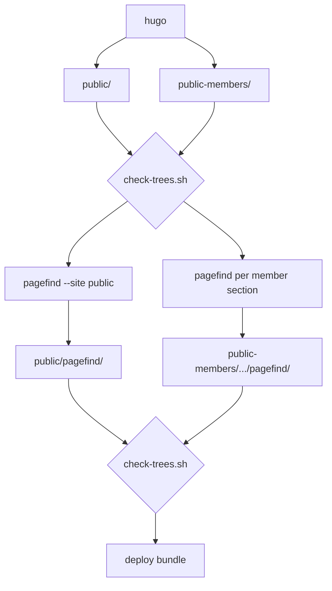

# Site search

## Summary

The site has a search box in the header. Typing into it shows matching pages
as you type, each with its title and a short piece of the page text with the
matched words highlighted in place.

[Pagefind](https://pagefind.app/) builds the index by reading the HTML that
Hugo has already produced, so nothing in the templates has to know that search
exists. The index is a set of static files served from disk like everything
else. There is no search server, no API key and no runtime query backend.

The interface is ours: a little over two hundred lines of vanilla JavaScript driving
Pagefind's JavaScript API, painting a dropdown panel that matches the rest of
the header. Pagefind's own user interface bundle is not used.

Signed-in members search member pages and public pages together in one list.
Everyone else searches public pages only, and the public index contains no
trace of the member pages — a property `check-trees.sh` verifies on every
build rather than one anybody has to remember.

## How it fits together



Pagefind runs after Hugo and after the first `check-trees.sh`, once per tree.
It parses the built HTML, so the pages generated from `site/data` are indexed
with no template work at all: `edelliset-hallitukset.md` carries a
one-sentence body and gets fifty-nine years of board members from
`hugo.Data` through `layouts/archive.html`, and all of those names are in the
index because the index is built from what the reader actually sees.

`check-trees.sh` runs twice. The first run proves the public HTML names no page
below a member section. The second proves the indexes derived from that HTML
are cleaner still — they may not name a member section at all — which needs its
own assertions because a Pagefind index is compressed and the HTML grep reads
straight past it.

## What gets indexed

`layouts/baseof.html` marks the page body:

```html
<main id="main" data-pagefind-body>
```

Without that attribute Pagefind indexes every `<body>`, which on this site
means the mega menu and the footer are indexed once per page. Every query then
matches every page: a search for `tietosuoja` returns fifty-nine results, one
per Finnish page, with excerpts that read
`Tärkeitä linkkejä→ Kielet. In English→ På svenska`. With the attribute the
same search returns four and `hallitus` returns sixteen.

The attribute is the whole of the configuration. Pages with no text inside
`<main>` are skipped, which is why the member tree's language home pages do not
appear in the member index: they render from a content root that has no
`_index.md` for the home page, so they come out as empty shells.

## Two trees, two kinds of index

### The public index

```
pagefind --site public
```

This writes `public/pagefind/`: 133 files, 1.06 MB, covering 112 pages and
10,028 distinct words. Pagefind reads the `lang` attribute on `<html>`, finds
`fi` and `en`, and builds a separate index for each. In the browser it reads
the same attribute and loads only the matching one, so a Finnish visitor
searches Finnish pages and an English visitor searches English pages, with no
configuration and no language switch in the interface.

### The member indexes, one per section

Both trees want `/pagefind/` at their root, and only one of them can have it.
Caddy serves `public/` at `/` and routes only the member section prefixes into
the gated directory, so a bundle at `public-members/pagefind/` answers on
`/pagefind/` — an address the public tree already owns. Pagefind's default
output path puts it exactly there.

Each member section therefore carries its own bundle, inside the gate that
already protects it:

```
pagefind --site public-members --glob "fi/**/*.html" --force-language fi \
         --output-path public-members/fi/jasenille/pagefind
pagefind --site public-members --glob "en/**/*.html" --force-language en \
         --output-path public-members/en/members/pagefind
```

`--glob` keeps each run to one language's pages and `--force-language` names
the language explicitly rather than leaving it to detection across a
two-page corpus. Each bundle holds two pages and weighs about 628 KB on disk,
nearly all of it the Pagefind runtime, which is never fetched from here — the
browser already has it from the public path. The duplicated runtime stays:
deleting it after indexing saves gated disk that nobody is short of, in
exchange for a build step that can silently break member search.

## How a member page searches both indexes

A member page loads the public index exactly as any other page does, then
merges its own section's index on top:

```js
const pagefind = await import("/pagefind/pagefind.js");
await pagefind.mergeIndex("/fi/jasenille/pagefind", { baseUrl: "/" });
```

`baseUrl: "/"` is required. Without it Pagefind treats the merged index as a
separate site and prefixes every merged result with the bundle's own path,
returning `/fi/jasenille/fi/jasenille/poytakirjat/`.

The merge costs **1,631 bytes**: the member entry file, its language metadata,
one index chunk and two fragments. The WebAssembly module and the runtime are
already loaded from the public path and are reused, so member search is
effectively free on the wire.

### Naming the bundle without naming it publicly

The header template emits the bundle address only in the member build:

```go-html-template
{{ if and site.Params.memberTree (not .IsHome) }} data-search-members="{{ .FirstSection.RelPermalink }}pagefind"{{ end }}
```

`config/members/hugo.toml` sets `memberTree = true` alongside the existing
`members = true`. The two params mean different things and both are needed.
`members` answers "may this build mention member pages at all", and is true in
the member build and in local preview. `memberTree` answers "is this page
served from the gated tree", and is true only in the member build.

This matters because local preview mounts both content roots into one site and
renders them to `public-preview/`, where a single Pagefind run already indexes
public and member pages together. A preview page must not try to merge a second
index, because there is not one. Guarding on `members` would make it try.

`.FirstSection.RelPermalink` resolves to the top-level section the page sits
in, which is the directory the bundle was written to. The home page is the
exception: its first section is itself, so it would name `/fi/pagefind`, an
address in the public tree where no bundle is written. `not .IsHome` drops the
attribute there. Verified across all three builds:

| Build | `/fi/` | `/fi/guild/` | `/fi/jasenille/poytakirjat/` | `/en/members/minutes/` |
|---|---|---|---|---|
| public | attribute absent | attribute absent | page not built | page not built |
| members | attribute absent | page not built | `/fi/jasenille/pagefind` | `/en/members/pagefind` |
| development | attribute absent | attribute absent | attribute absent | attribute absent |

The public build never emits the attribute, so the member bundle's address
appears in no public HTML.

### When the session has expired

This is the failure that has to be designed for, and the obvious handling of it
is wrong twice over.

A failed `mergeIndex` throws `Failed to load Pagefind metadata`, **and every
later `search()` on the same instance throws too**. A member whose Keycloak
session lapsed while the page was open does not get degraded search, they get a
dead search box with no results at all, public ones included. And the instance
cannot be recovered, because `import()` is cached and returns the same module.

The second trap is that Keycloak answers an expired session with a **200 and a
`text/html` login page**, so `response.ok` is true and a status check passes
while the merge still fails.

So the member index is probed before it is merged, and the content type is
checked:

```js
async function mergeMemberIndex(pagefind, bundle) {
  try {
    var r = await fetch(bundle + "/pagefind-entry.json", { credentials: "same-origin" });
    var ct = r.headers.get("content-type") || "";
    if (!r.ok || ct.indexOf("json") === -1) return false;
    JSON.parse(await r.text());
    await pagefind.mergeIndex(bundle, { baseUrl: "/" });
    return true;
  } catch (e) {
    return false;
  }
}
```

`mergeIndex` is never called speculatively. Behaviour in each case, measured
with the query `poytakirjat` on `/fi/jasenille/poytakirjat/`:

| The gate answers | Detected by | Member results | Public results |
|---|---|---|---|
| the index (healthy session) | — | 2 | 4 |
| 200 with an HTML login page | content type | none | 4 |
| 401 | status | none | 4 |
| 302 to `id.prodeko.org` | `fetch` rejects | none | 4 |

When the probe fails the status line reads "Jäsensisältö ei ole nyt
haettavissa — kirjaudu uudelleen." / "Member content is not searchable right
now — sign in again.", and public search keeps working.

## Proving the member pages stay out of the public index

`site/check-trees.sh` holds the assertions. Every `.pf_index`, `.pf_fragment`
and `.pf_meta` file begins `1f 8b` and is gzip, so the script's HTML grep reads
past the index entirely and reports nothing whatever it contains. Decompressing
first restores the test:

```bash
  if [ -d public/pagefind ] &&
     find public/pagefind \( -name '*.pf_index' -o -name '*.pf_fragment' -o -name '*.pf_meta' \) \
       -exec gzip -dc {} + 2>/dev/null | grep -qF -- "$path"; then
    echo "LEAK: the public search index contains $path" >&2
    status=1
  fi
```

Two structural assertions sit alongside it. No bundle may exist at
`public-members/pagefind/`, because that answers on `/pagefind/`, which is
public — one forgotten `--output-path` away. And the public index must hold
exactly as many pages as the public tree marks with `data-pagefind-body`,
which is 112 and 112, catching Pagefind aimed at the wrong tree.

Each assertion is verified against a planted failure:

| Tree state | Result |
|---|---|
| healthy | exit 0 |
| a member fragment copied into `public/pagefind/fragment/` | `LEAK: the public search index contains /fi/jasenille/`, plus the count mismatch |
| a bundle left at `public-members/pagefind/` | `LEAK: public-members/pagefind sits at the tree root, where /pagefind/ is public` |
| one extra fragment in the public index | `MISMATCH: public index holds 113 pages, the public tree marks 112` |

The section loop still reads its sections from `content-members/*/*/`, so a new
member section is covered the day somebody adds it.

Two subtleties govern how the test is written. The mega menu shows member
entries as disabled labels in the public build, so the **word** "Pöytäkirjat"
is legitimately present in public HTML and therefore in the public index. The
assertions test for the **path**, `/fi/jasenille/`. A test for the word would
fail on correct output.

The second is that this index test is stricter than the HTML test beside it,
and has to stay so. The HTML test allows a section landing page to be named,
because the header's sign-in button points at `/fi/jasenille/` on every public
page, and matches only `"$path[a-z0-9]"` — the path followed by a further
segment. The index test matches the bare path. The sign-in link sits in the
header, outside `data-pagefind-body`, so it never reaches the index; nothing
correct puts a member address there, and an address that is a published door in
HTML is a description of the member pages themselves once it is inside the
index. Verified by planting a fragment naming only `/fi/jasenille/`: the
relaxed pattern finds nothing in it, and the index test fails the build.

## The interface

### A nav item that opens a panel

The header gains a `Haku` / `Search` item beside the five section items. It
opens a panel that spans the header, built out of the same parts as a mega
panel: white, `--shadow-md`, the `pdFade` 180 ms entrance, and the 4 px
`--rainbow-gradient` strip across the top. The panel holds a large input and
the results beneath it.

A panel rather than an input in the bar, because a result is a title plus a
two-line excerpt with highlights, and that needs the width. A panel styled like
a mega panel rather than a new kind of object, because the header already has
one vocabulary for "something drops down from the bar" and a second one would
be noise.

The item is rendered by `layouts/partials/header.html` rather than listed in
`data/navigation.yaml`. That file maps titles to addresses and is editor-facing
through Decap; an entry with no address invites an editor to correct or delete
something they cannot see the purpose of.

```go-html-template
<button type="button" class="nav-search-toggle" data-search-toggle
        aria-expanded="false" aria-controls="search-panel">
  {{ if $isFi }}Haku{{ else }}Search{{ end }}
</button>
```

It sits immediately after the `</ul>` of `.nav-list`, inside `.desktop-nav`, so
it inherits the nav's typography. `navigation.yaml` holds sentence case and
`.site-header .nav-list a` applies `text-transform: uppercase`, so the word is
written `Haku` and the stylesheet shouts it.

The panel is a sibling of the mega panels, after the
`range $key, $columns := $megamenu` block that emits them:

```go-html-template
<div class="search-panel" id="search-panel" hidden>
  <div class="mega-panel-rainbow"></div>
  <div class="container search-panel-inner">
    <form role="search" onsubmit="return false">
      <input type="search" data-search role="combobox" autocomplete="off"
             aria-expanded="false" aria-controls="search-results"
             aria-autocomplete="list"
             {{ if and site.Params.memberTree (not .IsHome) }}data-search-members="{{ .FirstSection.RelPermalink }}pagefind"{{ end }}
             placeholder="{{ if $isFi }}Hae sivustolta{{ else }}Search the site{{ end }}"
             aria-label="{{ if $isFi }}Hae sivustolta{{ else }}Search the site{{ end }}">
    </form>
    <div class="search-results" id="search-results" role="listbox"></div>
    <div class="search-footer"></div>
    <p class="search-status" aria-live="polite"></p>
  </div>
</div>
```

Strings stay inline as `{{ if $isFi }}…{{ else }}…{{ end }}`, which is what
this partial does throughout. Four strings do not justify an `i18n/` directory.

### Opening on click, not on hover

`assets/js/mega-menu.js` opens the menu panels on `mouseenter` and `focusin`.
The search panel opens on click, or on Enter or Space, and never on hover: a
search panel that appears as the mouse sweeps across the bar is intolerable.
This is the one place the new item behaves differently from its neighbours and
the template says so in a comment.

Opening search closes any open mega panel. One line does it, with no change to
`mega-menu.js`, because that file already binds `closeAll` to the header's
`mouseleave`:

```js
header.dispatchEvent(new Event("mouseleave"));
```

### Keyboard

Enter or Space on the toggle opens the panel and moves focus into the input.
Escape closes it and returns focus to the toggle, and stops propagation, or the
document-level Escape handler in `mega-menu.js` fires as well. Arrow Down and
Arrow Up move the highlight and prevent default so the page does not scroll.
Enter goes to the highlighted result, defaulting to the first, so the common
case is type and press Enter. A click outside the header closes the panel.

Focus stays in the input for as long as the panel is open, which is what the
combobox pattern requires: the rows are never tab stops, and Tab leaves the
panel rather than walking through the results. The highlight is expressed by
`aria-activedescendant` on the input, pointing at the id of the highlighted
row, so a screen reader announces the row without focus having moved.

The input is `role="combobox"` with `aria-expanded`, `aria-controls` and
`aria-activedescendant`. `.search-results` is a `div` with `role="listbox"` — a `div` rather than a list,
so the rows can be anchors directly rather than anchors wrapped in list items
that carry the role. Each row is an anchor carrying `role="option"`, a stable
id and `tabindex="-1"`:

```html
<a role="option" tabindex="-1" id="search-result-3" href="/fi/guild/board/">…</a>
```

An anchor rather than a plain element, because a search result that cannot be
middle-clicked or opened in a new tab is a broken search result, and `href`
buys that for nothing. `tabindex="-1"` keeps it out of the tab order, where an
option does not belong.

The "show all" button is rendered into `.search-footer`, the sibling beneath
the listbox, because a listbox contains options and nothing else. It is an
ordinary button and an ordinary tab stop: Tab from the input reaches it and
then leaves the panel, while the options are reached with the arrow keys.

`.search-status` is `aria-live="polite"` and is the single place any status
text appears: the result count, the loading line, the no-results line and the
member-index line all write here. The count announcement is debounced to 300 ms
so it does not chatter through a word.

### On a phone

Below 860 px `.desktop-nav` and `.side` are hidden and `.mobile-nav` takes over
behind the toggle. The same form is the first child of `.mobile-nav .container`,
full width, above the accordions, with results rendered inline beneath it
rather than as an overlay. Opening the menu therefore puts search under the
reader's thumb immediately, and inline results avoid every positioning problem
inside a container that is already scrolling within
`max-height: calc(100dvh - 60px)`. The row is styled to the height of `.m-top`
so it reads as a top-level entry, with a 44 px minimum target to match
`.mobile-nav a`.

One script wires every `[data-search]` element, so the desktop and the phone
input share one Pagefind instance and one merged member index.

### Querying as the reader types

`search()` is debounced at **120 ms**. Pagefind fetches over the network rather
than searching in memory, so an undebounced keystroke costs requests: a single
query costs 10 requests and 223.3 KB of raw transfer, while typing `säännöt`
one letter at a time costs 15 requests and 237.9 KB. The chunk is cached;
the extra traffic is result fragments for queries the reader has already typed
past. 120 ms collapses a fast typist's keystrokes while still repainting inside
the interval a reader reads as immediate.

Six results are rendered, and `data()` is called **only for those six**. Each
`data()` call is one fragment fetch, so this is what bounds the traffic. When
more matched, a button beneath them reads "Näytä kaikki 17 tulosta" and
expands the panel to `max-height: 70vh; overflow-y: auto` rather than
navigating anywhere. There is no separate results page: it would need a
layout, a content file per language, an address in both languages and its own
empty and loading states, and the dropdown is where the reader is looking.

### What a result looks like

Title in `--pd-blue`, `--weight-semibold`, `--size-md`. Excerpt beneath it in
`--size-sm`, `--weight-light`, `--leading-normal`, clamped to two lines. Rows
divided by `1px solid var(--border-subtle)`; the highlighted row takes
`background: var(--pd-blue-tint-04)`.

`data()` returns the excerpt as HTML with `<mark>` already wrapped around the
matched words, so the highlight needs styling rather than building. The browser
default is a yellow that is not in this palette:

```css
.search-results mark {
  background: var(--pd-blue-tint-08);
  color: var(--pd-blue);
  font-weight: var(--weight-semibold);
  border-radius: var(--radius-ui);
  padding: 0 2px;
}
```

The excerpt is Pagefind's own HTML and is assigned with `innerHTML`. The title
and the address are ours and are assigned with `textContent` and `href`.

No new design token is needed. Adding one for a single component is how a token
file starts to drift.

### Where a result goes

A result lands on the matched text rather than the top of the page, which on
the rules pages is the difference between an answer and forty paragraphs to
scroll through. The `href` is built in two layers, because only one of them
works in every browser:

```
/fi/guild/guild-rules/rules/#25-%C3%A4%C3%A4ntenenemmist%C3%B6st%C3%A4
/fi/alumni/tietoa-alumnista/#prodekon-alumnin-hallitus-2026:~:text=hallitus%202026
/fi/new-students/#:~:text=s%C3%A4%C3%A4nn%C3%B6t%2C%20joilla%20fuksi
```

The anchor is Pagefind's. `data()` returns `sub_results`, one per heading the
match falls under, each with the heading's id already in its `url` and already
percent-encoded — Hugo generates the ids, so `Ääntenenemmistöstä` is addressable
without anything being written into the content. The row takes the sub-result
with the highest summed `balanced_score`, which is usually the page itself when
the title matched and the section otherwise.

The text fragment is ours. The sub-result's excerpt is cut from the page's own
text, so a phrase taken out of it is a phrase that is there to be found: the
first `<mark>`ed word plus up to two words after it, the `<mark>` tags dropped
by reading the excerpt back out of a detached element, and the whole thing
through `encodeURIComponent`. That encoding is load-bearing — a comma and a
hyphen are the text directive's own separators, and `ä` and `ö` are in half the
phrases on this site. The directive appends as `#anchor:~:text=…` after an
anchor and as `#:~:text=…` after a bare path.

Three rules keep the phrase honest. It stops at a full stop, because Pagefind
ends a block with one the page may not contain. It is dropped entirely below
two words, because a single common word is matched wherever it first appears,
which can be above the section the anchor names. And a title-only match, where
the excerpt carries no usable mark, keeps the plain page address.

Measured over fourteen Finnish queries and the 72 rows they render: 17 plain
page addresses, 18 an anchor alone, 14 an anchor and a directive, 23 a
directive on a bare path. Of the 37 directives, 31 name text a browser finds
inside a single block.

The other six span a block boundary that Pagefind joined with a space — a card
title glued to the paragraph beneath it, a table cell beside the next one — and
no browser will match across it. That costs nothing: an unmatched directive
falls back to the anchor, and a row with no anchor falls back to the top of the
page, which is where the address would have gone anyway. The same fallback
carries browsers that do not implement text fragments at all. No result is ever
worse off for the directive being there.

### While it loads, and when it finds nothing

The Pagefind module is imported when the panel first opens, not on page load,
so a reader who never searches pays nothing. Until it resolves the status line
reads "Haetaan…" / "Searching…", which in practice appears for a blink and then
never again that session. If the import fails it says so plainly rather than
leaving an empty list with no explanation.

No results shows the query back: «Ei tuloksia haulla "xyzzy"». Search is scoped
to the reader's own language and stays that way — a Finnish reader looking for
*säännöt* does not want *The Rules of The Guild*, and offering the other
language would mean a second Pagefind instance and another 70 KB WebAssembly
download to serve someone who searched in a language the page is not in.

## Finnish

Pagefind applies a Snowball stemmer for Finnish, which is what makes the
results usable on this site. Measured against this build:

```
hallitus 16   hallituksen 26   hallituksessa 26
kilta    43   killan      43   kiltaan       43
säännöt  12   sääntöjen    7   sääntö         7
```

`kilta`, `killan` and `kiltaan` all return 43, so consonant gradation works.
That is the case no amount of prefix or substring matching reaches, and it is
pervasive in the guild's own prose.

Pagefind normalises `ä` and `ö` itself, so a reader on a keyboard without them
is served: `saannot` returns 12 results, exactly what `säännöt` returns. **No
folding of the query is done in our code.** Adding it would be redundant.

The honest limit: the stemming is asymmetric. `hallitus` returns 16 while
`hallituksen` returns 26, because Snowball strips the oblique stem but leaves
the nominative `-s`. A reader who types the dictionary form of a word sometimes
sees fewer pages than one who types an inflected form. Nothing in scope fixes
this, and it is worth knowing before somebody reports it as a bug.

## What it costs the reader

Browser-measured, adjusted for the compression Caddy applies to the two
uncompressed JavaScript files. Everything else is gzip on disk already.

| | Gzipped |
|---|---|
| `pagefind.js` | 12.8 KB |
| `pagefind-worker.js` | 11.9 KB |
| `wasm.fi.pagefind` | 70.7 KB |
| entry file and language metadata | 0.8 KB |
| one Finnish index chunk | 10.2–53.8 KB, mean 38.2 KB |
| six result fragments | 10.8 KB at the 1.8 KB mean |
| **first search showing six results** | **115–157 KB, typically ≈142 KB** |
| the member index merged on top | **+1.6 KB** |

The fixed part, before any index chunk, is 93.2 KB. Later queries in the same
session fetch only chunks and fragments they have not already seen; a
five-query session measures 242.6 KB. None of it is on the page-load critical
path, because the import waits for the panel to open.

The three Finnish index chunks are 53.8 KB, 50.2 KB and 10.2 KB, and a query
touches one of them. The English index is 88.3 KB across three chunks.

## Building it

### In CI

One step in `.github/workflows/build.yml`, after the existing `check-trees.sh`
step and before the deploy bundle is assembled. A pinned standalone binary
fetched with `curl`, matching how Hugo is installed in the same workflow, and
consistent with the deliberate avoidance of marketplace actions elsewhere in
it.

```yaml
      # Pagefind reads the built HTML, so the pages generated from site/data are
      # indexed without the templates knowing search exists. After check-trees.sh
      # on purpose: that step proves the public HTML names no page below a member
      # section, and every index here is built from exactly that HTML.
      - name: Build the search indexes
        working-directory: site
        env:
          PAGEFIND_VERSION: v1.5.0
          PAGEFIND_SHA256: 0a10c6d780bc2a61378cfafe01be620a4de8400de4a1eafd180a0015d002000b
        run: |
          curl -sSLo pagefind.tar.gz \
            "https://github.com/pagefind/pagefind/releases/download/${PAGEFIND_VERSION}/pagefind-${PAGEFIND_VERSION}-x86_64-unknown-linux-musl.tar.gz"
          echo "${PAGEFIND_SHA256}  pagefind.tar.gz" | sha256sum -c -
          tar xzf pagefind.tar.gz pagefind
          ./pagefind --site public
          # One bundle per member section, inside the gate. A bundle at the root
          # of the member tree answers on /pagefind/, which the public tree owns.
          ./pagefind --site public-members --glob "fi/**/*.html" --force-language fi \
                     --output-path public-members/fi/jasenille/pagefind
          ./pagefind --site public-members --glob "en/**/*.html" --force-language en \
                     --output-path public-members/en/members/pagefind
          ./check-trees.sh
```

The digest is that of `pagefind-v1.5.0-x86_64-unknown-linux-musl.tar.gz`,
which holds a single `pagefind` binary. Pinning the tag alone pins a name;
pinning the digest pins the bytes, which is the reasoning that already puts the
SSH host key in `.github/known_hosts` rather than in a secret. Re-record it
when the version moves.

`check-trees.sh` runs twice and this is deliberate. The first run, where it
already is, proves the HTML is clean before anything is derived from it. The
second proves the derived indexes are clean too. It is a two-second script.

The three indexing runs take about two seconds between them. The public tree
grows by 1.06 MB across 133 files and each member section by about 628 KB.

The bundle contract is unchanged. The workflow already moves `site/public` to
`dist/public` and `site/public-members` to `dist/members`, so the member
bundles travel as `members/fi/jasenille/pagefind/` in the same tarball, and
`publish.sh` still extracts exactly `public` and `members`.

The audit builds its own tree with no index, which is correct: `search.js`
imports Pagefind only when the panel opens, the crawler never opens it, and
`tools/audit-site.mjs` counts only files ending `index.html` as built pages, so
nothing under `pagefind/` is reported as an orphan.

### Locally

Two terminals:

```
hugo server
npx pagefind@1.5.0 --site public-preview
```

`site/config/development/hugo.toml` sets `publishDir = "public-preview"`, so
Hugo serves that directory from disk and serves the index written into it:
`/pagefind/pagefind.js` answers 200, as do the entry file and the WebAssembly
module. The index survives a live-reload rebuild.

Editing a page rebuilds and serves the new text immediately while the index
stays as it was, so re-run the second command to see the change in search
results. It takes about a second. `site/public-preview/` is in `.gitignore`, so
a locally built index cannot be committed.

Local preview mounts both content roots into one site, so the preview index
holds public and member pages together and no merge happens — which is what
`memberTree` guards, and why the attribute is absent in that build.

`npx pagefind` announces itself as `Pagefind v1.5.0 (Extended)` while the
pinned release used in CI announces `Pagefind v1.5.0`. The extended build adds
word segmentation for Chinese and Japanese and nothing this site uses; on this
corpus the two differ by twelve indexed words out of ten thousand and produce
an equivalent index. The banner is not worth chasing.

### Files

| File | Change |
|---|---|
| `site/layouts/baseof.html` | `data-pagefind-body` on `<main>`; concatenate `mega-menu.js` and `search.js` into one bundle |
| `site/check-trees.sh` | the three index assertions |
| `site/config/members/hugo.toml` | `memberTree = true` under `[params]` |
| `site/layouts/partials/header.html` | the toggle, the panel, the phone form, `data-search-members` |
| `site/assets/js/search.js` | new, a little over two hundred lines of code |
| `site/assets/css/main.css` | a `/* ===== Search ===== */` section after the mega menu section |
| `.github/workflows/build.yml` | the indexing step and the second `check-trees.sh` |
| `README.md` | the two-terminal local loop |

`baseof.html` keeps the site at one script tag by concatenating, the way
`partials/head.html` already concatenates nine stylesheets. Both scripts are
IIFEs, so this is safe:

```go-html-template
{{ $js := slice (resources.Get "js/mega-menu.js") (resources.Get "js/search.js") | resources.Concat "js/bundle.js" | minify | fingerprint }}
<script src="{{ $js.RelPermalink }}" integrity="{{ $js.Data.Integrity }}" defer></script>
```

`search.js` follows the idiom of `mega-menu.js`: an IIFE, `var`, no modules. It
imports Pagefind lazily on first open and caches the promise, probes and merges
the member bundle when `data-search-members` is present, debounces `search()`
at 120 ms, calls `data()` for the six rendered rows, and handles rendering,
keyboard, ARIA and the live region for every `[data-search]` element on the
page.

### Order of work

The index and the gate first, because they are the part that can be wrong in a
way nobody sees. Run both Pagefind commands, run `check-trees.sh`, and confirm
in the browser console that
`(await (await import('/pagefind/pagefind.js')).search('hallitus')).results.length`
is 16 rather than 59. Then `search.js` against that index, then the panel styles
and the header, then the member merge and its failure path — which is easiest to
exercise by renaming the member bundle directory and confirming public results
still appear.

Under time pressure the phone panel goes first, since the desktop dropdown
stands on its own, and then the live-region announcement. `data-pagefind-body`
and the probe before `mergeIndex` do not go: without the first every query
matches every page, and without the second an expired session produces a dead
search box rather than a degraded one.

## Why not a hand-written index

A Hugo custom output format emitting one JSON file per language, searched by a
hand-written matcher, is a real alternative and it is smaller on the wire: 68.8
KB for the whole Finnish corpus, fetched once, against roughly 142 KB for a
first Pagefind search. It loses on three counts that outweigh the bytes. It
indexes `.Plain`, which on the archive pages is a single sentence, so the two
thousand names rendered from `site/data` need a special case in the template
that Pagefind does not need at all. Its Finnish is materially worse: across 21
queries on the same corpus, word-initial prefix matching returned fewer results
than Pagefind's stemmer on 18 of them, badly where gradation decides the answer
— `kiltaan` 3 against 43, `kilta` 25 against 43, `hallituksessa` 1 against 26.
And it has to build the snippet itself, selecting a window over match offsets,
snapping to word boundaries, escaping, and interleaving `<mark>` spans, which is
about 45 lines of the most error-prone code in the design, where `data()` simply
returns the excerpt with the marks already in it. Bytes are the cheapest of the
four things on the table.

## Correction to the design document

`2026-09-18-prodeko-git-cms-design.md` currently reads:

> Search. Neither prodeko.org nor tietokilta.fi has any. A build-time search
> index costs one line in the build and needs no server.

Replace with:

> Search. Neither prodeko.org nor tietokilta.fi has any. A build-time search
> index needs no server: it is a set of static files built from the pages
> themselves and served from disk like the rest of the site. The index costs one
> build step and one HTML attribute; the search box that reads it is a couple of
> hundred lines of our own. Members search member pages and public pages in one
> list, and the build fails if a member page reaches the public index.

The claim about needing no server is the competitive point and is exactly
right. The rest states what the feature costs, including the part that is the
interface rather than the index.
