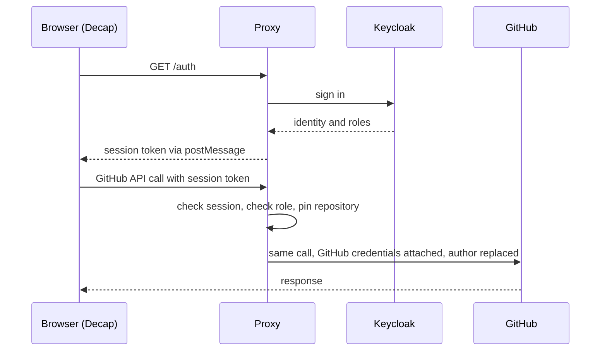

# Editor login proxy

The service that lets Decap CMS use Prodeko accounts instead of GitHub
accounts. It is the only new backend component in the design.

Written in Go, runs in Docker. `DEV.md` describes the local stack; `cmd/proxy`
is the binary and `internal/` holds the four pieces it wires together:
configuration, sign-in, sessions and the GitHub forwarder.

## What it does

Decap runs entirely in the browser and normally talks to GitHub directly, which
would mean every editor needs a GitHub account with write access. Decap does
let you redirect both its login and its GitHub calls elsewhere, and it treats
the login token as an opaque string without checking where it came from. This
service sits in that gap.



## Endpoints

- `GET /auth` starts the sign-in. Opens the Keycloak login and remembers where
  to return.
- `GET /callback` finishes it. Verifies the Keycloak response, checks the
  editor role, creates a session, and hands the session token back to the
  opener window with `postMessage`.
- `ANY /github/*` forwards to the GitHub API. Everything under here requires a
  valid session.
- `GET /healthz` says the process is listening. Unauthenticated, and it makes
  no claim about Keycloak or GitHub being reachable.

## Rules the implementation must follow

- Require an editor role from the Keycloak token. Without this, anyone with a
  Prodeko account can edit the website.
- Replace the author on every write with the name and email from the Keycloak
  session. Never trust an author supplied by the browser.
- Pin the repository. The owner and repository name come from configuration and
  are substituted into the forwarded path, so a modified browser cannot write
  somewhere else.
- Keep the GitHub credentials server-side. The browser only ever sees the
  session token.
- Issue our own session token rather than passing the Keycloak token through.
  Decap does not renew an expired login, so the session outlives the Keycloak
  access token and is refreshed behind the scenes.
- Allow only the GitHub paths Decap actually uses. Repository contents, git
  objects, pull requests, and the current user. Not collaborators, webhooks or
  secrets.

## Operational constraints

Two pieces of state live in memory, which bounds how this may be deployed.

**One replica.** The half-finished sign-ins between `/auth` and `/callback` are
held in process. A second replica, or a restart mid-login, fails that sign-in
with "This sign-in was not recognised". Scaling past one container needs a
shared state store first.

**Sessions outlive role changes.** A session token is a self-contained sealed
blob carrying the roles the editor held at sign-in, and Decap never renews a
login. Removing an editor's realm role in Keycloak takes effect when their
session expires (`SESSION_TTL`, 8h by default). `session.Store.Revoke` cuts one
session short, but no endpoint is mounted to call it and its deny-list is in
memory; the blunt instrument is rotating `SESSION_SECRET`, which signs everyone
out.

## Configuration

Expected as environment variables. Every one of them, with its validation
rule, is documented in `.env.example`; `internal/config` refuses to start the
service on a partial configuration and reports every problem in one pass.

Required:

- `KEYCLOAK_ISSUER`, `KEYCLOAK_CLIENT_ID`, `KEYCLOAK_CLIENT_SECRET`
- `EDITOR_ROLE`, the realm role required to edit
- `GITHUB_TOKEN`, a fine-grained token on a bot account, scoped to one
  repository with contents, pull request and issue write access
- `GITHUB_OWNER`, `GITHUB_REPO`, `GITHUB_BRANCH`
- `SESSION_SECRET`, at least 32 bytes
- `PUBLIC_URL`, the address this service is reachable at, as a bare origin
- `CMS_ORIGINS`, the origins the editing screen is served from. Decap's calls
  to `api_root` come from the browser, cross-origin, so these are the origins
  CORS allows. `*` is refused.

Optional:

- `LISTEN_ADDR`, `LOG_LEVEL`, `SESSION_TTL`, `OAUTH_SCOPE`, `GITHUB_API_ROOT`
- `GITHUB_COMMITTER_NAME`, `GITHUB_COMMITTER_EMAIL`, the bot identity recorded
  as the git committer. The author is the editor and is never configurable.
- `KEYCLOAK_DISCOVERY_URL`, for split-horizon setups such as the dev compose
  stack, where the browser and the proxy reach Keycloak at different
  addresses. Discovery happens here; `iss` is still checked against
  `KEYCLOAK_ISSUER`.

## How the site points at it

In the Decap configuration under `site/`:

```yaml
backend:
  name: github
  repo: prodeko/prodeko-hack
  branch: main
  base_url: https://cms.prodeko.org
  auth_endpoint: auth
  api_root: https://cms.prodeko.org/github
```

The local development mode that Decap offers must stay switched off. It
bypasses this service entirely, so testing with it exercises none of the real
login path while appearing to work.

## Prior art

The same combination of Decap, Keycloak and a server-side GitHub credential has
been built before, in
[CivicDataLab pull request 316](https://github.com/CivicDataLab/civicdatalab.github.io/pull/316).
Worth reading before starting. Its author notes that a full save through the
real editing screen was never tested end to end, so that is the first thing to
prove here rather than the last.
